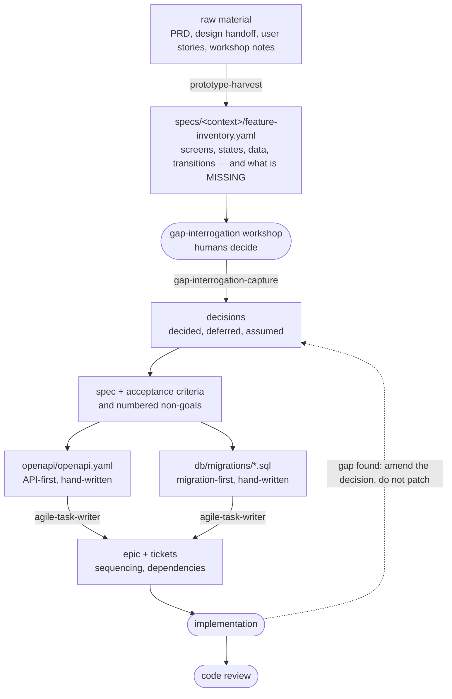

# Contributing

Payments module for the EduGo portal — TypeScript, Fastify, Kysely, Postgres.
Package manager is **pnpm** (Node 22+, ESM-only). Before you start, skim
[`README.md`](README.md) for the layout and [`CLAUDE.md`](CLAUDE.md) for the
architecture rules; the stack rationale is in
[`docs/adr/0001-backend-stack.md`](docs/adr/0001-backend-stack.md).

## 1. Ground rules

Four rules that never bend, whatever the size of the change:

1. **A pull request, never a push to `main`.** If an agent asks permission to commit,
   the answer is a branch and a PR — never "push it live".
2. **The gate is green before merge.** The static gate for this repo is:

   ```bash
   pnpm typecheck && pnpm test
   ```

   There is no separate linter — `pnpm typecheck` (`tsc --noEmit`) is the static gate,
   and `pnpm test` runs the integration suite. CI is not wired up yet, so run both
   locally before opening a PR.
3. **A missing decision is a stop, not a guess.** If a question is genuinely undecided,
   it goes back to the team — don't tell an agent to "pick something sensible" and bury
   the choice in a handler.
4. **API-contract and database changes get an engineer review.** Those two are hard
   contracts that outlive the change — see [§4](#4-changing-the-api-contract) and
   [§5](#5-changing-the-database).

## 2. Getting set up

```bash
pnpm install
cp .env.example .env

# a local Postgres for dev (separate from the throwaway one tests spin up)
docker run -d --name edugo-pg -p 5432:5432 \
  -e POSTGRES_PASSWORD=postgres -e POSTGRES_DB=edugo_payments postgres:16-alpine

pnpm db:migrate      # apply SQL migrations
pnpm codegen         # regenerate BOTH generated trees — required after a fresh clone
pnpm dev             # http://localhost:3000/api/v1
```

The whole `.generated/` tree is **gitignored and machine-generated** — never hand-edit
it, and a fresh clone will not typecheck or test until `pnpm codegen` has run. It has two
independent sources: `codegen:openapi` (from `openapi/openapi.yaml`) and `codegen:db`
(introspects the **live migrated** database on `$DATABASE_URL`, so it needs a running DB
that has had `pnpm db:migrate` applied). Regenerate after any contract or migration change.

**Docker runtime is required** for `pnpm test` (Testcontainers) and local Postgres.
**Colima users** must point the socket explicitly:

```bash
export DOCKER_HOST="unix://$HOME/.colima/default/docker.sock"
export TESTCONTAINERS_DOCKER_SOCKET_OVERRIDE="/var/run/docker.sock"
```

## 3. How a feature gets built

A large feature travels one pipeline, from pinned raw material to code that can be traced
back to a decision. Each stage produces an artefact the next one consumes. The payments
slice is the first pass through it, and so far only the harvest artefact exists
(`specs/payments/feature-inventory.yaml`); the later stages are the intended shape, not a
paper trail that already exists for every feature.



Two rules make the pipeline worth having:

- **Traceability runs both ways.** A line of code traces back to an acceptance criterion;
  a criterion traces back to the decision that produced it. If you cannot walk the line
  back, either the criterion is missing or the code is.
- **A late discovery goes back to the artefact that owns it.** Finding a gap during
  implementation means amending the decision or the spec and coming forward again — not
  patching the handler and leaving the spec describing something else.

### Not every change earns the full pipeline

The pipeline is for a feature big enough that people would otherwise argue later about
what was agreed. Most changes are smaller: a bug fix, a copy tweak, a new field. Start
where it makes sense, but the four rules in [§1](#1-ground-rules) still apply — especially
a PR, a green gate, and an engineer review the moment the change touches the contract or
the database.

## 4. Changing the API contract

`openapi/openapi.yaml` is the source of truth. Routes are bound to handlers by
`operationId` via `fastify-openapi-glue`, and DTO types are generated from the spec —
never hand-written.

1. Edit `openapi/openapi.yaml`.
2. Run `pnpm codegen:openapi` (or `pnpm codegen`) to regenerate the DTO types.
3. Implement or adjust the handler in `src/payments/adapter/http/incoming/`, keeping the
   DTO↔domain translation in `PaymentMapper`.
4. New domain errors surface with the right status only if they are mapped in
   `setErrorHandler` in `src/platform/http/server.ts` (`AccountNotFoundError` → 404, other
   `DomainError` → 422, validation → 400, else 500, all as `application/problem+json`).

An API-contract change needs an engineer review.

## 5. Changing the database

Schema is migration-first: hand-written SQL under `db/migrations/`.

1. `pnpm db:migrate:create <name>` scaffolds a SQL migration.
2. Write the `up` (and a real `down`); apply it with `pnpm db:migrate`.
3. Re-run `pnpm codegen:db` so `kysely-codegen` re-introspects the migrated database —
   the generated schema must match what actually ran.

Domain invariants the schema and DAO code must preserve:

- **Money is integer minor units held as `bigint`** — never floats. Postgres `bigint`
  round-trips as strings, so DAO code converts with `.toString()` / `BigInt(...)`.
- **The ledger is append-only** (`ledger_entries`); corrections are new reversing entries,
  never updates or deletes.
- **Invariant INV-1:** `account_balances.balance_minor == SUM(ledger_entries.amount_minor)`
  per account, maintained in the *same* transaction and asserted by tests.
- **Idempotency:** `Idempotency-Key` → unique `payments.idempotency_key`; a replay returns
  the original result (200) with no second entry, a fresh record returns 201.

A database change needs an engineer review.

## 6. Architecture and domain

Hexagonal / DDD, organized per bounded context (`src/payments/` is the only one today),
with technical bootstrap in `src/platform/`. The domain is framework- and DB-free.
Dependency injection is Awilix in PROXY mode: every class takes a single `deps` object and
is registered in the `Cradle` in `src/platform/container.ts`. The full rules — the request
flow, the single-transaction unit of work, the domain invariants — live in
[`CLAUDE.md`](CLAUDE.md); read it before adding a wired class or a new context.

## 7. Testing

Tests are **integration tests against real Postgres via Testcontainers** — Docker must be
running. `test/setup/postgres.ts` starts a throwaway `postgres:16-alpine`, applies the
migrations, and hands back a connection string (separate from your dev DB). Timeouts are
120s and the pool is `forks` (see `vitest.config.ts`).

```bash
pnpm test                                              # full suite
pnpm test:watch                                        # watch mode
pnpm vitest run test/payments/record-payment.int.test.ts   # a single file
pnpm vitest run -t '<name>'                             # filter by title
```

## 8. Review

Open a PR against `main`. Use `/code-review` for an automated pass; the `peer-reviewer`
skill is available for a deeper review of specs, plans, or code. A green gate is necessary
but not sufficient — a human still signs off, and any change to the API contract or the
database is reviewed by an engineer ([§1](#1-ground-rules)).

## 9. Skills

Project-pinned agent skills live in `.agents/skills/` and are tracked by
`skills-lock.json` — notably `domain-driven-design`, `postgresql-table-design`,
`prototype-harvest`, `gap-interrogation-capture`, `agile-task-writer`, `peer-reviewer`,
`zod`, and `ponytail`. Use them for the stages they cover rather than reinventing the step.
