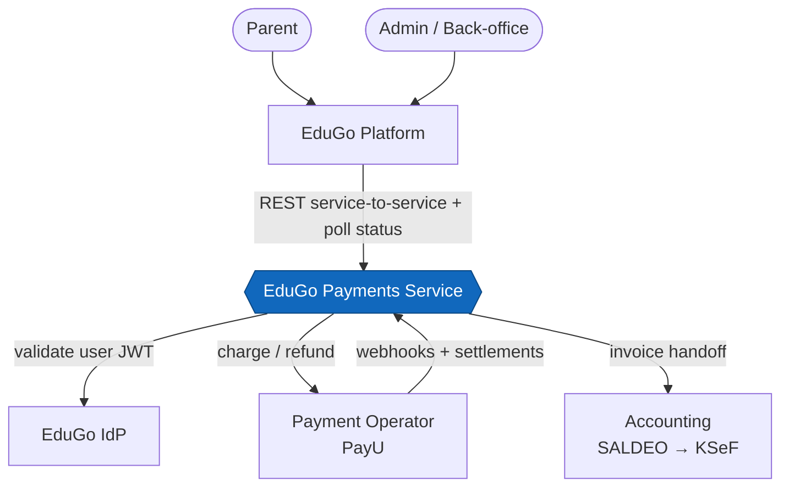
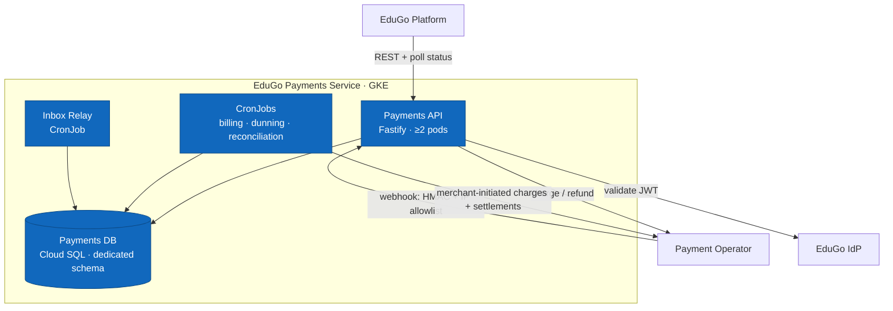
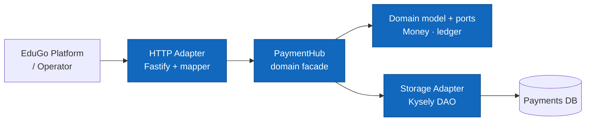

# Architecture — C4 model (EduGo Payments Service)

**Status:** Draft · **Date:** 2026-09-21 · **Author:** Krzysztof Jackowski

C4 model derived from the specs, in three levels. Diagrams are Mermaid flowcharts (render on
GitHub); labels are kept short — see the ADRs for the detail.

**Related:** [PRD](../prd.md) · [ADR 0002 — deployment](../adr/0002-deployment-and-infrastructure.md) · [ADR 0003 — async backbone](../adr/0003-async-backbone.md) · [ADR 0004 — API auth](../adr/0004-api-auth.md)

Three facts the model encodes: the service is **standalone, service-to-service, private-by-default**
(one REST API); the **only public ingress** is the operator-webhook path; async is **Postgres +
CronJobs only**, status is **pull-based** (no bus, no outbox).

> **Legend:** in every diagram below, **blue marks the elements under description** — the service (Level 1), its containers (Level 2), and its components (Level 3).

---

## Level 1 — System Context

Humans reach payments **only through** the EduGo Platform (service-to-service). The IdP that issues
the forwarded user JWT is assumed, not confirmed (ASM-4).

---

## Level 2 — Containers

Everything runs on **GKE (`europe-central2`)**, private VPC; data at rest stays in the EU.

- **Payments API** — REST `/api/v1`, webhook ingest (fast ACK), status-polling endpoint.
- **Inbox Relay** — drains `operator_events`, applies each in one txn → exactly-once (INV-2/3).
- **CronJobs** — single-runner via advisory lock (INFRA-3).
- *(A pre-deploy Migration Job applies DDL and gates the rollout — ADR-0005; omitted above for clarity.)*

---

## Level 3 — Components (Payments API)

Hexagonal layering: the domain is framework/DB-free; adapters depend inward through ports.

Wired by the awilix composition root (`src/platform/container.ts`); each write goes through
`UnitOfWork.withTransaction` so the ledger append and balance update commit together.
