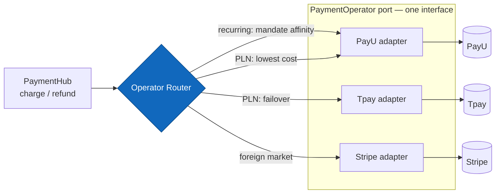
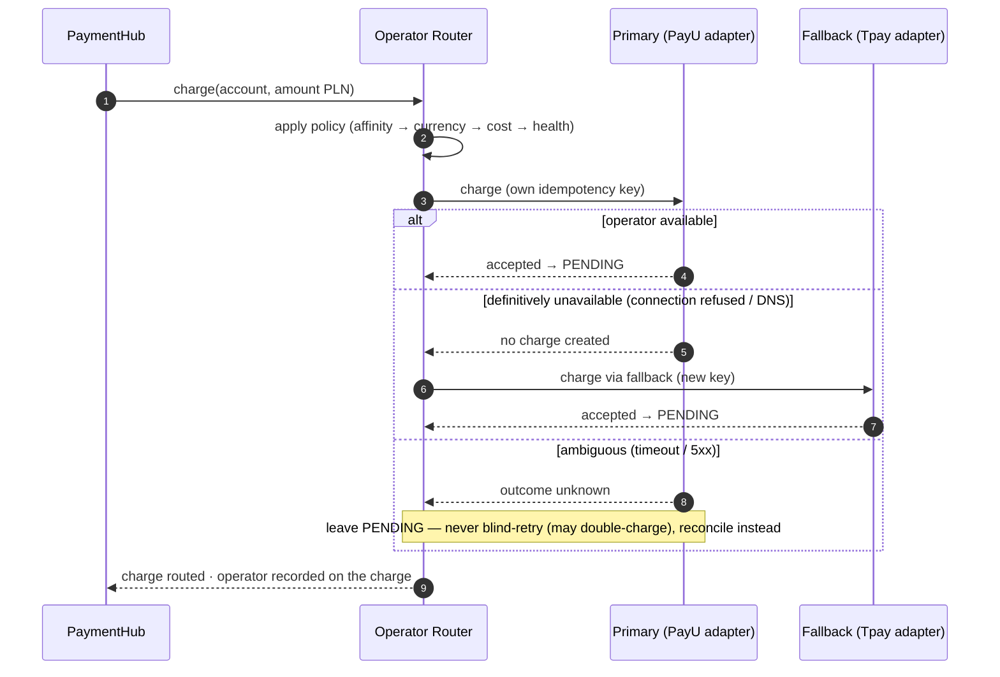

# Dual-operator routing

**Status:** Draft · **Date:** 2026-09-21 · **Author:** Krzysztof Jackowski

One **operator abstraction** (a driven port) with several adapters behind it, and a **router** that
picks an operator per charge on a cost/market/health policy. The point is that the domain never names
an operator — it charges through the port, and every operator's webhooks and settlements flow back
through the *same* abstraction.

**Related:** [C4 model](architecture-c4.md) · [pull auto-charge](sequence-pull-auto-charge.md) · [reconciliation](sequence-reconciliation.md) · [PRD](../prd.md) (FR-16, DD-5, G6, A4, ASM-1)

> **Scope (A4):** this iteration is **PLN only**, so in M1 PayU is the effective primary. The
> abstraction and a second adapter are built to *prove* routing and failover; Stripe (foreign markets)
> is designed here but wired later.

_Legend: **blue marks the routing decision** under description (the Operator Router)._

## Structure — one port, N adapters

The port is a single interface (`charge`, `refund`, `createHostedSession`, `verifyWebhook`,
`parseSettlement`); each adapter normalizes one operator's API and vocabulary onto it.

## Routing policy (in priority order)

1. **Mandate / token affinity (recurring).** A stored token/mandate is **operator-specific** — a PayU
   token cannot be charged via Stripe. Subsequent merchant-initiated charges **must** route to the
   operator that tokenized the mandate. This overrides cost.
2. **Currency / market.** PLN → domestic operators (PayU / Tpay); foreign currency or market → Stripe (G6).
3. **Cost.** Among eligible, healthy operators, pick the **lowest fee** (DD-5) — the "cost-based routing."
4. **Health / failover.** Skip an operator that is unhealthy or under a change-freeze; fall back to the
   alternate (mitigates the "operator downtime during burst" risk).

## Failover on a first (customer-initiated) charge

## Why it's shaped this way

- **The chosen operator is recorded on the charge.** Inbound events must correlate back to the operator
  that raised them — the inbox is keyed `UNIQUE(operator, event_id)`, and each webhook is verified with
  **that operator's** HMAC secret. Routing is not just an outbound concern; it's how inbound dispatch and
  reconciliation know which adapter to use.
- **Reconciliation stays operator-agnostic.** Each adapter's `parseSettlement` normalizes its operator's
  file into the same shape, so the [three-way match](sequence-reconciliation.md) is written once.
- **Idempotency is ours** (ASM-1), so failover is safe *only on a definitive failure.* We do **not**
  fail over on a bare timeout — the primary may have actually charged; that would double-charge. A timed-out
  primary charge is left `PENDING` and resolved by the webhook or by reconciliation, not by blind retry
  on the other operator.
- **The domain never branches on operator.** `PaymentHub` calls the port; adding Tpay or Stripe is a new
  adapter + a routing rule, no change to the ledger, state machine, or use cases.

## Not shown here

- **Mandate migration** between operators (re-tokenizing a parent onto a new operator) — a later concern;
  M1 keeps a mandate on its original operator.
- **Per-operator webhook secrets / IP allowlists** — each operator has its own; managed in Secret Manager
  (ADR-0006), selected by the `operator` on the event.
- **Live cost tables / routing config** — the fee data the cost rule reads is configuration, not modelled here.
