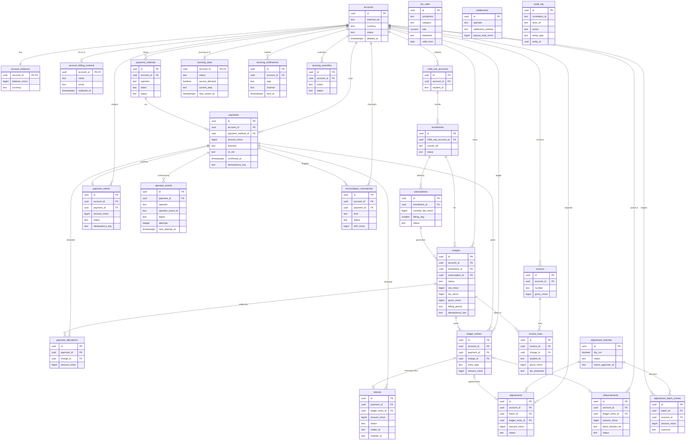

# ERD — payments schema

**Status:** Draft · **Date:** 2026-09-23 · **Author:** Krzysztof Jackowski

Entity-relationship view of `specs/payments/contracts/schema.sql` (post-review). Attributes are
**trimmed to PK/FK + a few key columns** for legibility — the SQL is the source of truth.

**Related:** [schema.sql](../../specs/payments/contracts/schema.sql) · [schema review](../../specs/payments/contracts/peer-review-schema.md) · [C4 model](architecture-c4.md)

Conventions: `*_minor` columns are `bigint` integer minor units (never float); `PK`/`FK` marked;
base tables (`accounts`, `payments`, `ledger_entries`, `account_balances`) come from the init migration.

## Notes

- **Parent-account aggregate:** `accounts` is the single balance-bearing root (`account_balances`
  1:1); `child_sub_accounts` → `enrollments` → `subscriptions` are billing structure, not balances.
- **Ledger link direction (PR-S5):** `ledger_entries` points at the `charge` it realises; each
  correction (`refunds`/`adjustments`/`disbursements`) points at *its* reversing entry via
  `ledger_entry_id`. No bidirectional FK — and `ledger_entries` is append-only (INSERT-only, enforced).
- **Standalone tables:** `tax_rates` (effective-dated lookup), `settlements` (reconciliation ingest),
  and `audit_log` (its `entity_id` is a soft reference, deliberately not an FK) have no drawn edges.
- **Not shown:** every non-key column, CHECK constraints, indexes, and idempotency keys — see
  [schema.sql](../../specs/payments/contracts/schema.sql).
