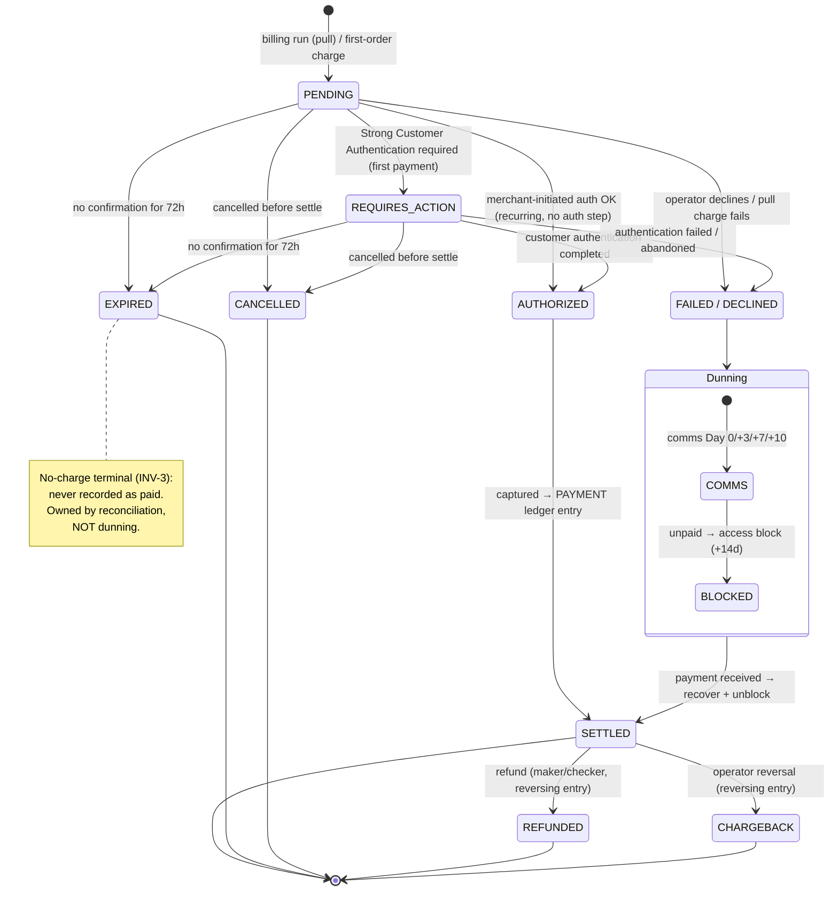

# Charge / payment state machine

**Status:** Draft · **Date:** 2026-09-21 · **Author:** Krzysztof Jackowski

EduGo's **own** canonical charge/payment lifecycle — not operator vocabulary; operator outcomes are
mapped onto these states. Source: `specs/payments/glossary.md` (state machine), `decisions.yaml`
(ABS-2, ABS-12), `feature-inventory.yaml` (TRN-1…8), ASM-2 (72h).

**Related:** [PRD](../prd.md) · [glossary](../../specs/payments/glossary.md)

## Rules the diagram encodes

- **Two entry paths.** A **customer-initiated transaction** (CIT — the first payment) needs **Strong
  Customer Authentication** (SCA) → `REQUIRES_ACTION`; recurring **merchant-initiated transactions**
  (MIT) authorize without customer interaction (`PENDING → AUTHORIZED`).
- **`SETTLED` is the only paid state** — it writes the `PAYMENT` ledger entry (INV-3). Reversal after
  settlement is only via **`REFUNDED`** (maker/checker + idempotency key, PR-005) or **`CHARGEBACK`**;
  both are new reversing entries, never in-place edits (INV-4, ABS-12).
- **`EXPIRED` ≠ `FAILED/DECLINED`.** `EXPIRED` = no operator response within **72h** (ASM-2): a
  no-charge terminal handled by reconciliation. `FAILED/DECLINED` = operator actively rejected → enters
  **dunning** immediately.
- **Dunning is recoverable.** Any successful payment during comms or block → **immediate unblock**,
  dunning state cleared, charge recovered to `SETTLED`. Intervals are ASM-3 (tunable).
- **Cancellation** is only allowed while `PENDING` / `REQUIRES_ACTION`; once `SETTLED`, the only way
  back is refund/chargeback (ABS-12).

## Out of scope / open

- **Write-off** of an indefinitely-blocked account (a `BLOCKED` account that never pays) is a policy
  terminal not modelled for M1 — see glossary *Write-off*.
- The exact `FAILED` vs `DECLINED` split (technical failure vs operator rejection) is collapsed here;
  both behave identically (→ dunning). Split them if operator outcomes need distinct handling.
