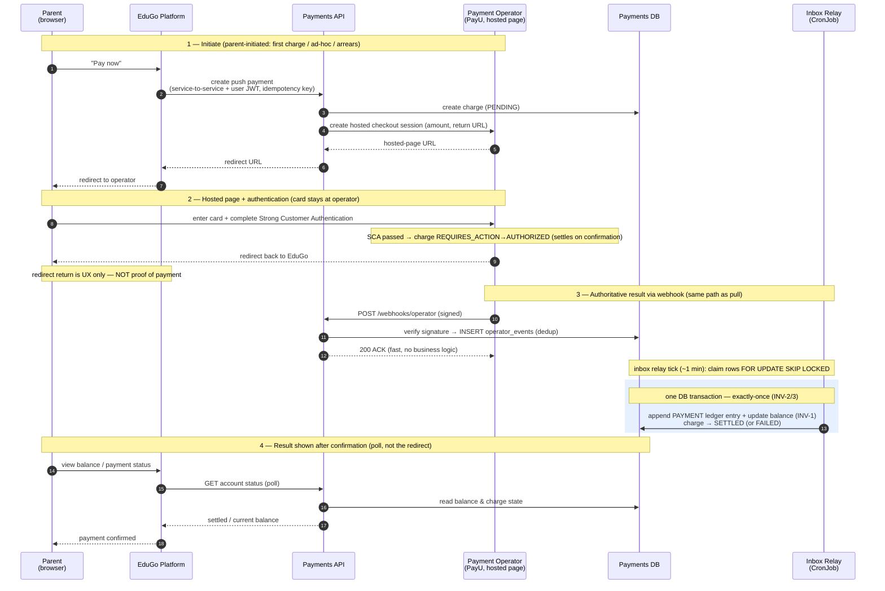

# Sequence — push payment (hosted page / redirect → webhook)

**Status:** Draft · **Date:** 2026-09-21 · **Author:** Krzysztof Jackowski

The **push** path: a parent initiates a payment (first charge, ad-hoc top-up, or arrears), completes
it on the **operator's hosted page** with **Strong Customer Authentication**, and is redirected back.
The redirect is UX only — the payment is recorded, exactly as in the pull path, **only** from the
signed webhook. Payments is not a browser-facing service; the card never touches it (PCI SAQ-A).

**Related:** [pull auto-charge sequence](sequence-pull-auto-charge.md) · [ADR 0004 — API auth](../adr/0004-api-auth.md) · [state machine](payment-state-machine.md) · [PRD](../prd.md) (FR-5, A11, INV-1/2/3)

## Why it's shaped this way

- **The redirect return is never authoritative.** Crediting an account when the browser lands back on
  EduGo is the classic double-/lost-payment bug: the user can close the tab, the network can drop, or
  the return can be forged. The account moves **only** when the signed webhook is applied — so this path
  reuses the pull path's `operator_events` inbox + relay verbatim (the highlighted transaction).
- **Payments is not a BFF.** The parent's browser talks to EduGo and to the operator's hosted page,
  never to payments (ADR-0004). Card data is entered at the operator and tokenized there — payments
  stores only tokens/mandates (PCI SAQ-A, A11).
- **First payment is customer-initiated with SCA** (`REQUIRES_ACTION`); the same push flow also serves
  ad-hoc payments and arrears settlement. Subsequent recurring charges are the **pull / merchant-initiated**
  path — [see the pull sequence](sequence-pull-auto-charge.md).
- **Idempotency on initiate.** The create call carries an idempotency key, so a double "Pay now" (impatient
  parent, retried request) yields one charge, not two.
- **Result is pulled, not pushed** (ADR-0003): the parent sees confirmation after the webhook is applied,
  via the status poll — consistent with the rest of the system.

## Not shown here

- **The confirm-and-record detail** (signature verify, inbox dedup, single-transaction apply) is drawn
  fully in the [pull auto-charge sequence](sequence-pull-auto-charge.md); compressed here to keep focus
  on the distinctive redirect/authentication leg.
- **Timeout / abandonment.** If the parent never completes the hosted page and no webhook arrives, the
  charge follows `PENDING → EXPIRED` after 72h (ASM-2) — see the [state machine](payment-state-machine.md).
- **Decline handling** (`FAILED` → dunning) — same as the pull path.
