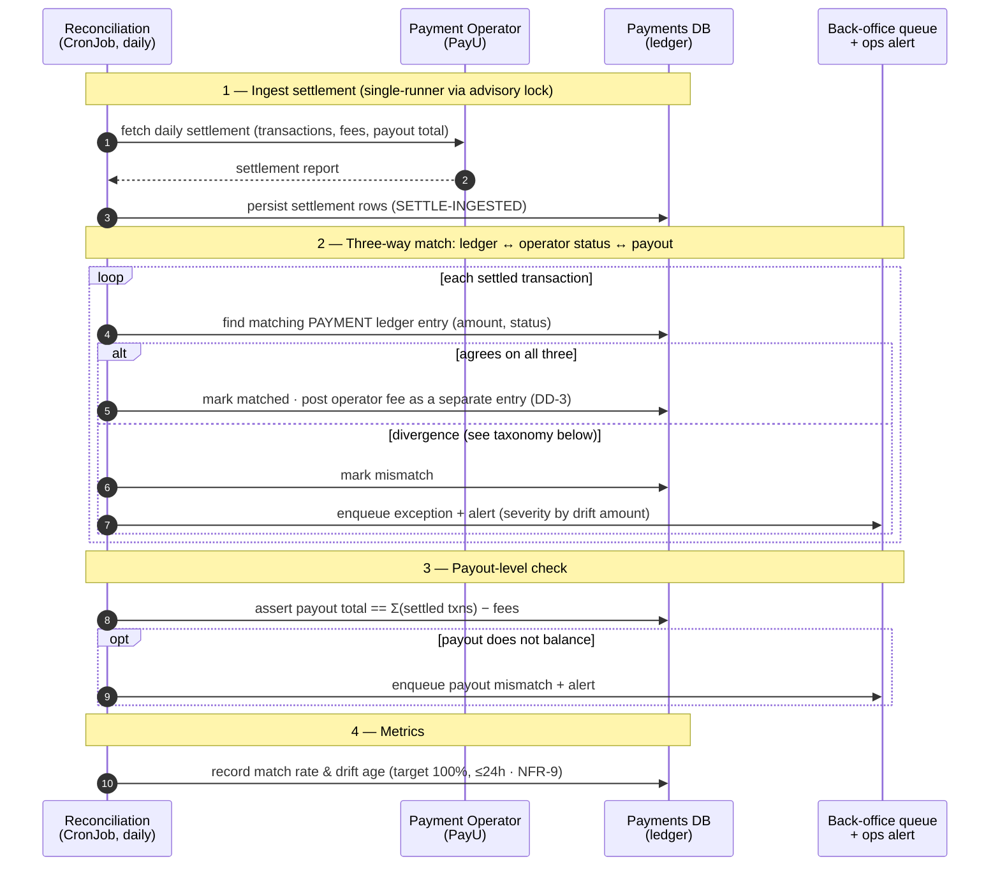

# Sequence — reconciliation

**Status:** Draft · **Date:** 2026-09-21 · **Author:** Krzysztof Jackowski

The **daily** safety net for the async collection path: ingest the operator's settlement, run a
**three-way match** (ledger ↔ operator status ↔ payout), post fees as their own ledger entries, and
route any divergence to the back-office queue. This is what catches a missed webhook or a drifting
balance before it becomes a financial-correctness incident.

**Related:** [ADR 0003 — async backbone](../adr/0003-async-backbone.md) · [pull auto-charge sequence](sequence-pull-auto-charge.md) · [PRD](../prd.md) (FR-15, DD-3, INV-1/3, §4 metrics)

## Mismatch taxonomy

A mismatch is **any** divergence the three-way match finds. All seven route to the **back-office queue
+ ops alert** — **never** to the parent (glossary), severity scaled by the drift amount:

1. **Ledger payment absent from settlement** (or later declined/reversed) — the INV-3 guard.
2. **Operator settled with no ledger entry** — a missed / dead-lettered webhook.
3. **Amount mismatch** — partial capture, rounding.
4. **Fee mismatch** — operator fee ≠ expected (fees are separate entries, DD-3).
5. **Refund / chargeback out of sync** between us and the operator.
6. **Settlement-window / timing boundary** (mitigated by the operator-window decision).
7. **Payout total ≠ Σ(settled txns) − fees.**

## Why it's shaped this way

- **It closes the async loop.** The pull path is eventually consistent and a webhook can be lost or
  dead-lettered. Cases 1 and 2 are exactly that gap — reconciliation is the independent check that the
  ledger and the operator agree, so INV-3 ("no payment without a matching confirmation") is *verified*,
  not just intended.
- **Fees are their own ledger entries** (DD-3), never folded into the payment — gross, fee, and net stay
  separately auditable and feed the payout-total check (case 7).
- **Reconciliation flags; humans correct.** It never mutates a posted entry. A confirmed correction is a
  new **reversing** entry made through maker/checker (INV-4) from the back-office queue.
- **Parents never see a mismatch** — it's an internal ops concern; the queue + alert are the only outputs.
- **The SLO lives here** (PRD §4): target **100% match rate**, drift detected **within 24h**; match rate
  and drift age are golden signals for NFR-9.

## Not shown here

- **Resolving** a queued exception (the back-office correction workflow) — a separate maker/checker flow.
- **Multi-operator** settlement formats — each operator adapter normalizes to the same match; the
  three-way match itself is operator-agnostic.
