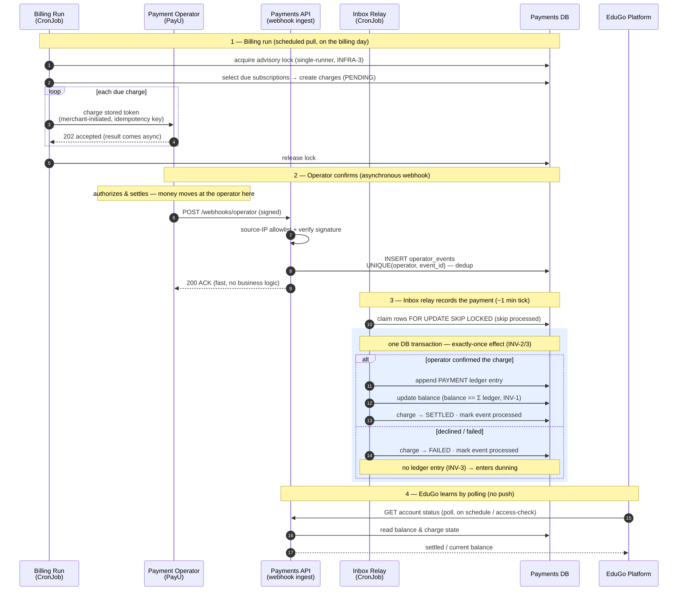

# Sequence — pull auto-charge (the money diagram)

**Status:** Draft · **Date:** 2026-09-21 · **Author:** Krzysztof Jackowski

The recurring **pull** collection path: a scheduled billing run charges a stored payment method
(**merchant-initiated**), the operator confirms **asynchronously** via a signed webhook, and the
payment is recorded to the ledger by the inbox relay in **one transaction**. This is the money path —
where a charge becomes a `PAYMENT` ledger entry and the balance moves.

**Related:** [ADR 0003 — async backbone](adr/0003-async-backbone.md) · [state machine](payment-state-machine.md) · [PRD](prd.md) (FR-1/4/6, INV-1/2/3)

## Why it's shaped this way

- **The charge and the money are decoupled.** The billing run only *creates* charges and *asks* the
  operator; it never moves money or writes a payment. Money is recorded **only** when the relay applies
  a confirmed operator event — so a billing-run crash mid-loop cannot post a phantom payment.
- **The webhook does almost nothing.** It verifies the signature, writes the raw event to the
  `operator_events` inbox, and returns `200`. The `UNIQUE(operator, event_id)` constraint is the dedup
  and gives **at-most-once** (INV-2); a duplicate webhook is a no-op insert.
- **One transaction is the whole correctness story.** The relay appends the `PAYMENT` ledger entry,
  updates the balance, and marks the charge `SETTLED` + the event processed **together**. A crash before
  commit re-processes safely; `balance == Σ ledger` (INV-1) always holds. This is the highlighted block.
- **Status is pulled, not pushed** (ADR-0003 #4): EduGo polls the status endpoint; payments never calls
  back into the platform. Balance is eventually consistent on the order of ~1–2 minutes (the relay
  cadence) — instant confirmation is not a requirement.

## Not shown here

- **First payment (customer-initiated).** A new order's first charge needs **Strong Customer
  Authentication** (a hosted-page / redirect push flow, `REQUIRES_ACTION`), not this merchant-initiated
  pull path — a separate sequence.
- **Reconciliation.** The daily three-way match (ledger ↔ operator status ↔ payout) that catches a
  settled payment with no ledger entry, or vice-versa, runs on its own CronJob (FR-15).
- **Dunning detail.** The `FAILED` branch enters dunning (comms → access block); see the
  [state machine](payment-state-machine.md).
