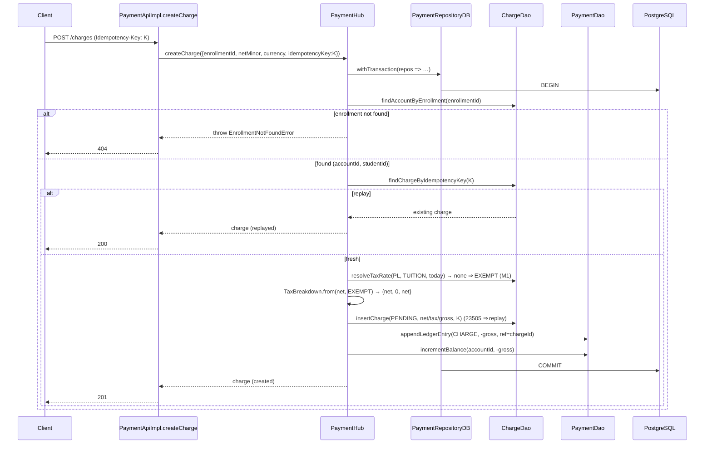
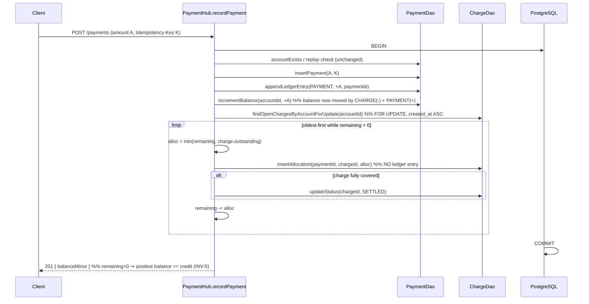

# Tech Spec: Charge Lifecycle & Payment Allocation — Deep Dive

**Epic:** `edugo-payments-service-f4c4` — Charge lifecycle & payment allocation
**Date:** 2026-09-23
**Depth:** Deep Dive
**Status:** Draft
**Spec:** [`specs/payments/spec.md`](../specs/payments/spec.md) (AC-11, AC-19–21, AC-29–33; INV-1/5/7)
**Contracts:** [`openapi/openapi.yaml`](../openapi/openapi.yaml) · [`db/migrations/1790150435617_payments-core.sql`](../db/migrations/1790150435617_payments-core.sql)
**Features:** [`allocation-and-credit.feature`](../specs/payments/features/allocation-and-credit.feature) · [`charge-lifecycle.feature`](../specs/payments/features/charge-lifecycle.feature)
**Related:** [`docs/implementation-plan.md`](implementation-plan.md) (Milestone M1, items 1–2) · [ADR-0001](adr/0001-backend-stack.md)
**Child tasks:** `1t6l` (storage seam) · `d4bk` (createCharge) · `ncro` (allocation) · `5sjm` (invariant tests)

---

## 1. Context & Goals

### Problem Statement

The payments context today can only move money **in**: the `record-payment` slice appends a
`PAYMENT` ledger entry and increments the materialized balance in one transaction (INV-1 holds).
What it cannot yet do is represent what a parent **owes**. There is no way to post a charge, no
concept of a charge that a payment settles, and no allocation of an incoming payment against open
charges. A parent's balance therefore only ever trends positive; the receivable side of the ledger
is missing.

This epic layers the **receivable side** onto the existing ledger/balance machinery: model the
charge, post it to the ledger as arrears, and allocate payments across open charges oldest-first so
the balance reflects the true net position (owed vs. paid). The database schema for this
(`charges`, `payment_allocations`, `tax_rates`) is **already migrated** — the init and
`payments-core` migrations created every table and index this epic needs. The `createCharge`,
`getCharge`, and `listCharges` operations already exist in the OpenAPI contract. **This epic is
code-only: domain ports, storage adapters, use-case orchestration, DI wiring, and tests. No new
migration and no contract change are required.**

### Goals

1. **Post a charge to the ledger.** `POST /charges` resolves a tax breakdown (net/tax/gross),
   writes a `PENDING` charge, and posts a `CHARGE` ledger entry for the **gross** as a **negative**
   (arrears) amount — all in one transaction, with `balance == SUM(ledger_entries)` preserved
   (AC-29/30, INV-1/INV-7). Idempotent via `Idempotency-Key`.
2. **Allocate payments oldest-first.** An incoming payment pays down the account's open charges
   in `created_at` order; a fully-covered charge transitions `PENDING → SETTLED`; over-allocation
   remains as positive balance (credit) (AC-19/21, INV-5, FR-9).
3. **Prove the invariants.** An integration suite asserts INV-1 (balance == Σ ledger) survives
   both charge and allocation, INV-7 (gross == net + tax) on every charge, and INV-5 (oldest-first,
   no double-pay, over-allocation → credit) end-to-end against real Postgres.
4. **Read a charge and an account's charges.** `GET /charges/{chargeId}` returns a charge and its
   lifecycle state (AC-11); `GET /accounts/{accountId}/charges` returns an account's charges
   paginated, filterable by status — the open-charge view that drives oldest-first allocation
   (AC-19). Both are part of this epic.

### Non-Goals

Each traces to an out-of-scope note in the epic or a DEFERRED decision in the spec:

- **NG-A — Effective-dated tax-rate engine.** `createCharge` performs a single point-in-time
  lookup and defaults to `EXEMPT` when no rate matches (AC-32). The full effective-dated resolution
  engine (rate versioning, half-up per-line rounding of multi-line documents, AC-31) is later work.
- **NG-B — The rest of the charge state machine.** Only the `PENDING → SETTLED` settle path is
  implemented. `REQUIRES_ACTION`/`AUTHORIZED` (SCA), `EXPIRED` (72h sweep, AC-12), `DECLINED`/
  `FAILED` → dunning (AC-16), and cancellation (AC-26) are out of scope. (`getCharge`/`listCharges`
  read the state the write path produces — they are in scope, Goal 4 — but do not add transitions.)
- **NG-C — Refunds, adjustments, chargebacks, dunning, reconciliation.** Designed elsewhere;
  these reverse or re-open allocations and are explicitly deferred (INV-6/AC-25 not in scope).
- **NG-D — Subscriptions & billing run.** `createCharge` here is the *new-order first charge*.
  Recurring charges produced by the monthly billing run (M2) are out of scope; the `subscription_id`
  / `billing_period` columns stay null on charges created by this endpoint.
- **NG-E — Operator confirmation gating (INV-3/AC-13).** The existing `record-payment` slice posts
  a `PAYMENT` entry directly (no operator round-trip yet); this epic keeps that behavior and adds
  allocation on top. Wiring `PAYMENT` to a real operator confirmation is the webhook-intake epic.
  **Design constraint (so allocation survives that move):** in the target architecture
  (ADR-0003, NFR-2/3) the `PAYMENT` entry is posted by the **inbox-relay apply path** on operator
  confirmation (~1–2 min eventual), *not* by the synchronous `POST /payments`. Allocation must run
  **in the same transaction as the `PAYMENT` entry** (INV-5 requires it), so it is deliberately
  factored as a `PaymentHub` method that operates on the transaction's repo bundle — never as
  HTTP-handler logic. When `PAYMENT` posting moves to the relay, allocation moves with it, unchanged.

### Background

- **Hexagonal / DDD, one bounded context (`src/payments/`).** Domain is framework-free; adapters
  wrap Fastify and Kysely; `src/platform/container.ts` (Awilix PROXY mode) is the composition root.
  See [`CLAUDE.md`](../CLAUDE.md).
- **Money is integer minor units as `bigint`.** Postgres `bigint` round-trips as a string; DAO
  code converts with `.toString()` / `BigInt(...)`. The `Money` value object enforces this and the
  ISO-4217 currency shape.
- **Ledger is append-only; balance is materialized.** `PaymentDao.appendLedgerEntry` inserts;
  `PaymentDao.incrementBalance` applies a signed `bigint` delta via an upsert with an atomic
  `balance_minor + delta` update. INV-1 (`balance_minor == Σ amount_minor`) is maintained in the
  same transaction as each entry and is asserted by `record-payment.int.test.ts`.
- **The `UnitOfWork` seam.** `PaymentRepositoryDB.withTransaction` opens one Kysely transaction and
  hands the callback a transaction-bound `PaymentDao`. This epic reshapes that seam (see Decision 1)
  — a change the Tier-1 operator-ingestion relay (`9uk0`) also builds on, so it is coordinated as a
  shared task (`1t6l`, PR-E2-4).

### Stakeholders

| Role | Interest |
|------|----------|
| Payments engineering | Owns the correctness core; must not regress INV-1 or the `record-payment` slice. |
| Tier-1 relay epic (`6siz`/`9uk0`) | Consumes the same reshaped `UnitOfWork` bundle — coordinate the seam once. |
| Finance / Tax | Tax breakdown correctness (INV-7) and the EXEMPT default for PL tuition. |
| QA | Invariant suite (`5sjm`) is the acceptance gate. |

---

## 2. Architecture Approach

### High-Level Design

The charge lives in the existing `payments` bounded context alongside payments. Two write flows —
`createCharge` and the extended `recordPayment` — share **one** `UnitOfWork` transaction that now
exposes both a payments repository and a charges repository, so a charge (or an allocation) and its
ledger effect commit atomically.

```
                          POST /charges                         POST /payments
                               │                                     │
                               ▼                                     ▼
                    ┌──────────────────────┐             ┌──────────────────────┐
                    │  PaymentApiImpl       │             │  PaymentApiImpl       │
                    │  .createCharge        │             │  .recordPayment       │
                    └──────────┬───────────┘             └──────────┬───────────┘
                     PaymentMapper.toCreateChargeCommand   PaymentMapper (existing)
                               │                                     │
                               ▼                                     ▼
                    ┌───────────────────────────────────────────────────────────┐
                    │                     PaymentHub (facade)                     │
                    │  createCharge(cmd)              recordPayment(cmd)          │
                    └──────────────────────────┬────────────────────────────────┘
                                               │  unitOfWork.withTransaction(repos ⇒ …)
                                               ▼
                    ┌───────────────────────────────────────────────────────────┐
                    │        PaymentRepositoryDB.withTransaction (one trx)        │
                    │   hands { payments: PaymentDao, charges: ChargeDao }        │
                    └───────────┬───────────────────────────────┬───────────────┘
                                │                               │
                                ▼                               ▼
                      ┌───────────────────┐          ┌────────────────────┐
                      │   PaymentDao      │          │   ChargeDao        │  (new)
                      │  (payments,       │          │  (charges,         │
                      │   ledger_entries, │          │   payment_alloc-   │
                      │   account_bal.)   │          │   ations,tax_rates)│
                      └─────────┬─────────┘          └─────────┬──────────┘
                                └──────────────┬───────────────┘
                                               ▼
                                        PostgreSQL (one transaction)
```

### Design Decisions

**Decision 1: `UnitOfWork` hands a repository *bundle*, not a single `PaymentRepository`.**
- **Chosen:** `withTransaction<T>(work: (repos: RepositoryBundle) => Promise<T>)` where
  `RepositoryBundle = { payments: PaymentRepository; charges: ChargeRepository }`. `PaymentDao`
  and `ChargeDao` are both constructed on the **same** `Transaction<DB>` inside
  `PaymentRepositoryDB.withTransaction`.
- **Alternatives considered:**
  - *Keep the single `PaymentRepository` and add charge methods to it* — rejected: bloats the
    payment port with unrelated concerns and blurs the aggregate boundary between Payment and Charge.
  - *A second, independent `UnitOfWork` per aggregate* — rejected: a charge + its ledger entry (and
    an allocation + its charge-status flip) must be **one** transaction; two units of work cannot
    guarantee that.
- **Rationale:** The atomicity boundary is the transaction, not the aggregate. Bundling repos over
  one `trx` keeps each DAO cohesive while letting a use case touch both tables atomically.
- **Trade-offs:** Reshapes an interface two existing tests and the `recordPayment` call site depend
  on. Mitigated by doing the reshape **once, first** (`1t6l`) and having both this epic and the
  Tier-1 relay consume it (PR-E2-4).
- **Reversibility:** Medium — it is an internal port; changing it later is a mechanical refactor,
  but doing it once now avoids a second migration of the same seam.

**Decision 2: A `CHARGE` posts the GROSS to the ledger as a NEGATIVE amount.**
- **Chosen:** `appendLedgerEntry({ type: 'CHARGE', amount: gross.negate(), … })`, then
  `incrementBalance(accountId, gross.negate())`. Net and tax are stored as **attributes** of the
  `charges` row, never as separate ledger entries (AC-30).
- **Alternatives considered:** *Split net and tax into two ledger entries* — rejected by AC-30; the
  ledger carries gross only, tax lives on the charge.
- **Rationale:** Sign convention (`LedgerEntryType.ts`): `PAYMENT`/`CREDIT` positive,
  `CHARGE`/`FEE`/`CHARGEBACK` negative. A charge reduces the balance (arrears). The DB
  `charges_gross_chk` CHECK (`gross_minor = net_minor + tax_minor`) enforces INV-7 at write time.
- **Trade-offs:** Callers must remember to negate; centralized in `PaymentHub.createCharge` so it
  is written once.
- **Reversibility:** Hard — it is the ledger sign contract; every downstream reconciliation depends
  on it. It is already the established convention, so this decision only *applies* it.

**Decision 3: Allocation is LEDGER-NEUTRAL (the load-bearing decision of this epic).**
- **Chosen:** Allocating a payment writes `payment_allocations` rows and flips charge `status` to
  `SETTLED` **only**. It posts **no** ledger entry and does **not** touch `account_balances`.
- **Alternatives considered:** *Post an allocation/settlement ledger entry* — **rejected**: this
  double-counts. The balance is already moved by the `CHARGE` (−gross) and `PAYMENT` (+amount)
  entries; a third entry for the allocation would break INV-1.
- **Rationale:** The balance is `Σ (CHARGE − ) + Σ (PAYMENT + )`. "Over-allocation becomes credit"
  (INV-5) is *simply the positive balance those two entry types already produce* — not a new
  `CREDIT` entry. `payment_allocations` is a **link/attribution** table (which payment paid down
  which charge, and how much), not a money-moving table.
- **Trade-offs:** The rule is counter-intuitive ("allocation moves money" is the naive mental
  model) and easy to get wrong in review; hence it is called out in the epic Risks (PR-E2-1) and
  asserted directly: `5sjm` verifies `balance == Σ ledger_entries` is **unchanged** by allocation.
- **Reversibility:** Hard — reversing it (posting entries on allocation) would corrupt every
  balance. This is a correctness invariant, not a preference.

**Decision 4: Concurrent allocation is serialized with `SELECT … FOR UPDATE` on open charges.**
- **Chosen:** `findOpenChargesByAccountForUpdate` reads the account's open charges
  `ORDER BY created_at ASC … FOR UPDATE` inside the payment's transaction (AC-20, PR-008).
- **Alternatives considered:** *Rely on the single-row balance lock* — rejected: the balance lock
  serializes balance writes but does **not** prevent two payments from each allocating to the same
  charge and over-settling it. INV-5 is a per-charge property that needs per-charge row locks.
- **Rationale:** Under READ COMMITTED, `FOR UPDATE` on the charge rows blocks a concurrent payment
  until the first commits, so the second sees the updated `SETTLED` status / allocation totals and
  cannot double-pay.
- **Trade-offs:** Serializes concurrent payments *for the same account* (acceptable — scale is
  single-digit TPS; different accounts do not contend). Lock-ordering by `created_at ASC` is stable,
  avoiding deadlocks between two payments on the same account.
- **Reversibility:** Medium.

**Decision 5: `createCharge` resolves the tax breakdown server-side, defaulting to EXEMPT.**
- **Chosen:** The request carries only `{ enrollmentId, netMinor, currency }` (per the existing
  contract). The handler resolves `account_id` + `student_id` from the enrollment, looks up
  `tax_rates` for `(jurisdiction='PL', category=<default 'TUITION'>)` effective today, and — when
  none matches — defaults to `EXEMPT` (`tax_minor = 0`, `gross = net`, `tax_rate = 0`, a legal
  reason string set) (AC-32/33, PR-E2-5).
- **Alternatives considered:** *Require the caller to pass the breakdown* — rejected: the contract
  deliberately keeps the request minimal; tax is a server responsibility.
- **Rationale:** PL tuition is VAT-exempt; the effective-dated engine is deferred (NG-A), but the
  `EXEMPT` default is both correct for M1 and satisfies the `charges_tax_legal_reason_chk` CHECK
  (a legal reason is mandatory for `EXEMPT`/`ZERO_RATED`).
- **M1 scope — EXEMPT only.** For M1, `createCharge` produces an `EXEMPT` breakdown for **every**
  charge (`tax_minor = 0`, `gross = net`), regardless of whether a `tax_rates` row happens to exist.
  Computing tax from a found non-exempt rate — including AC-31 half-up per-line rounding
  (`tax_minor = roundHalfUp(net_minor × rate)`, then `gross = net + tax`) — is deferred with the
  effective-dated engine (NG-A) and, when built, lives in the `TaxBreakdown` **domain VO**, not the
  DAO. This keeps M1 unambiguous and avoids an implementation-defined rounding the moment a
  `STANDARD`/`REDUCED` row is seeded. (The resolver still *reads* the table so the wiring is proven,
  but M1 treats the outcome as EXEMPT.)
- **Trade-offs:** Jurisdiction and category are effectively constants for M1; when the engine lands,
  only the resolver + `TaxBreakdown.from(...)` change, not the charge write path.
- **Reversibility:** Easy — the resolver is a single injected step.

### Module/Package Placement

```
src/payments/
├── domain/
│   ├── PaymentHub.ts                 → + createCharge(cmd); recordPayment(cmd) extended to allocate
│   ├── model/
│   │   ├── Money.ts                  → (reuse; may add subtract()/min() helpers — see §5)
│   │   ├── LedgerEntryType.ts        → (reuse; 'CHARGE' already present)
│   │   └── ChargeStatus.ts           → NEW: 'PENDING' | 'REQUIRES_ACTION' | 'AUTHORIZED'
│   │                                        | 'SETTLED' | 'DECLINED' | 'EXPIRED' | 'FAILED'
│   ├── TaxBreakdown.ts               → NEW: value object { net, tax, gross, rate, treatment,
│   │                                        legalReason, jurisdiction } enforcing gross=net+tax
│   ├── port/
│   │   ├── UnitOfWork.ts             → CHANGED: withTransaction((repos: RepositoryBundle) => …)
│   │   ├── PaymentRepository.ts      → (reuse)
│   │   └── ChargeRepository.ts       → NEW port (see §3/§5)
│   └── Errors.ts                     → + EnrollmentNotFoundError (404), CurrencyMismatchError reuse
├── adapter/
│   ├── http/incoming/
│   │   ├── PaymentApiImpl.ts         → + createCharge, getCharge, listCharges handlers
│   │   └── PaymentMapper.ts          → + toCreateChargeCommand / toChargeDto / toChargePage
│   └── storage/
│       ├── PaymentRepositoryDB.ts    → CHANGED: constructs { payments, charges } on one trx
│       ├── PaymentDao.ts             → (reuse)
│       └── ChargeDao.ts              → NEW: implements ChargeRepository over Kysely
└── (platform)
    └── container.ts                  → bundle built in PaymentRepositoryDB; no new top-level
                                         Cradle entry required (tax-rate lookup is a ChargeDao
                                         method — see §6 for the lookup-vs-math split)
```

### Cross-Component Impact

| Component | Impact | Action Required |
|-----------|--------|-----------------|
| `PaymentHub.recordPayment` | Call site changes to the bundle signature; gains an allocation step after the balance increment. | Update to `repos.payments.…`; add allocation. |
| `record-payment.int.test.ts`, `server-boot.int.test.ts` | Depend on the old `withTransaction((repo) => …)` shape (indirectly, through the hub). | Verify green after the bundle reshape; adjust only if they touch the seam directly. |
| Tier-1 relay (`9uk0`) | Builds the transactional inbox/relay on the same `UnitOfWork`. | Consume the bundle from `1t6l`; do not re-reshape (PR-E2-4). |

---

## 3. API Design

Both operations already exist in [`openapi/openapi.yaml`](../openapi/openapi.yaml); this epic
implements their handlers. No contract change.

### Endpoint 1: `POST /charges` — `operationId: createCharge`

**Purpose:** Post a new-order charge against an enrollment and record it on the ledger as arrears.

**Request** (`application/json`; `Idempotency-Key` header required):
```json
{
  "enrollmentId": "uuid — the enrollment being billed — required, must exist",
  "netMinor":     "int64 ≥ 1 — net amount in minor units (grosze) — required",
  "currency":     "enum [PLN] — ISO-4217 — required (PLN-only, app-enforced, AC-8)"
}
```

**Response (201 — created / 200 — idempotent replay):** `Charge`
```json
{
  "id":           "uuid",
  "accountId":    "uuid — resolved from the enrollment",
  "enrollmentId": "uuid",
  "studentId":    "string — resolved from the enrollment's child sub-account",
  "status":       "PENDING",
  "currency":     "PLN",
  "tax": {
    "netMinor": 149900, "taxMinor": 0, "grossMinor": 149900,
    "taxRate": 0, "taxTreatment": "EXEMPT",
    "taxLegalReason": "PL tuition — VAT exempt (art. 43)", "taxJurisdiction": "PL"
  },
  "amountOwedMinor": -149900,
  "createdAt": "2026-09-23T10:00:00Z"
}
```
`amountOwedMinor` is the gross **signed per the ledger convention** (negative = owed).

**Error Responses:**

| Status | Code | When | Client Action |
|--------|------|------|---------------|
| 400 | ajv validation | Missing/invalid body field, or missing `Idempotency-Key` | Fix input |
| 404 | `ENROLLMENT_NOT_FOUND` | `enrollmentId` does not resolve to an account | Check the ID |
| 422 | `CURRENCY_MISMATCH` / other `DomainError` | Non-PLN currency (AC-8) or other rule breach | Correct and retry |
| 200 | — | `Idempotency-Key` already applied — original charge returned | Treat as success |

**Validation:** `enrollmentId` uuid; `netMinor` ≥ 1 (int64); `currency` ∈ {PLN}. `Idempotency-Key`
header required (mapped to `charges.idempotency_key`, UNIQUE).

**Idempotency:** `Idempotency-Key` → `charges.idempotency_key` (UNIQUE). A replay returns the
original charge with **no** second charge row and **no** second ledger entry (200). A concurrent
unique-violation (`23505`) is caught as `DuplicateIdempotencyKeyError` and resolved as a replay —
mirroring `recordPayment` exactly.

### Endpoint 2: `POST /payments` — `operationId: recordPayment` (extended)

Contract unchanged (`RecordPaymentRequest` → `PaymentRecorded`). Behavior gains a
**ledger-neutral allocation** step: after the `PAYMENT` entry is appended and the balance
incremented, the payment is allocated across the account's open charges oldest-first within the
**same** transaction. The response DTO is unchanged (`balanceMinor` already reflects the net
position, i.e. any residual credit). Allocation failures (e.g. `CURRENCY_MISMATCH` against a charge)
surface as 422 via the existing error handler.

### Endpoint 3: `GET /charges/{chargeId}` — `operationId: getCharge`

**Purpose:** Return a single charge and its lifecycle state (AC-11).

**Response (200):** `Charge` (same shape as `createCharge`, reflecting the current `status`).
`amountOwedMinor` = the charge's **outstanding** signed per the ledger convention
(`−(gross − Σ allocations)`), so a `SETTLED` charge reads `0` and a partially-paid `PENDING` charge
reads its remaining owed.

**Errors:** 404 `CHARGE_NOT_FOUND` when the id does not exist; 401 per the shared responses.

**Backed by:** `ChargeDao.findChargeById` + `sumAllocationsForCharge` (for outstanding).

### Endpoint 4: `GET /accounts/{accountId}/charges` — `operationId: listCharges`

**Purpose:** List an account's charges, paginated, optionally filtered by status — the open-charge
view that drives allocation (AC-19).

**Query params:** `limit` (page size), `cursor` (opaque forward cursor), `status`
(`ChargeStatus`, optional filter — e.g. `PENDING` to see open charges).

**Response (200):** `Page` envelope `{ nextCursor, items: Charge[] }`, `items` ordered
**`created_at ASC`** (oldest-first — the same order allocation consumes, so the list is a faithful
preview of allocation order). `nextCursor` is null on the last page.

**Errors:** 404 `ACCOUNT_NOT_FOUND`; 403 `Forbidden` (RBAC placeholder — the response is wired but
role enforcement is a later cross-cutting concern, AC-48).

**Backed by:** `ChargeDao.listChargesByAccount(accountId, { status?, limit, cursor })` — a keyset
page ordered `(created_at, id)`, cursor = `(created_at, id)`. Outstanding is computed per item as in
`getCharge`.

**Pagination & index reality:** keyset (seek) on `(created_at, id)`, not `OFFSET` — stable under
concurrent inserts. Note the live `charges_account_status_idx (account_id, status)` serves the
`WHERE account_id = ? [AND status = ?]` **filter only**; the `ORDER BY created_at, id` is an
in-memory sort of that filtered set. This is fine at M1 scale (single-digit-to-tens of charges per
account). If ordering ever needs to be index-served, a **future** migration would add
`(account_id, status, created_at, id)` — out of scope here (the schema is frozen for this epic).
`limit` is clamped to the contract's `Limit` max (200, default 50).

---

## 4. Sequence Diagrams

### Happy path: create a charge



### Happy path: record a payment with allocation (ledger-neutral)



### Error / concurrency flow: two payments race to settle the same charges

```mermaid
sequenceDiagram
    participant P1 as Payment #1 (trx1)
    participant P2 as Payment #2 (trx2)
    participant DB as PostgreSQL

    P1->>DB: BEGIN; SELECT open charges FOR UPDATE (locks rows)
    P2->>DB: BEGIN; SELECT open charges FOR UPDATE (BLOCKS on P1's locks)
    P1->>DB: insert allocations; updateStatus SETTLED
    P1->>DB: COMMIT (locks released)
    P2->>DB: (unblocks) sees charges now SETTLED / fully allocated
    Note over P2,DB: P2 allocates only to still-open charges;<br/>no charge double-paid (INV-5). Its excess stays as credit.
    P2->>DB: COMMIT
```

---

## 5. Data Model

**No migration in this epic.** All tables, CHECKs, and indexes below already exist in
[`db/migrations/1790150435617_payments-core.sql`](../db/migrations/1790150435617_payments-core.sql)
(and the `ledger_entries`/`account_balances` in the init migration). This section documents the
tables the epic reads and writes and the domain types that map onto them.

### `charges` (written by `createCharge`, status-updated by allocation)

| Field | Type | Constraints | Notes |
|-------|------|-------------|-------|
| id | uuid | PK, `gen_random_uuid()` | |
| account_id | uuid | NOT NULL, FK→accounts, ON DELETE RESTRICT | Resolved from enrollment. |
| enrollment_id | uuid | FK→enrollments | Set by `createCharge`. |
| subscription_id | uuid | FK→subscriptions | **null** here (billing-run only, NG-D). |
| student_id | text | | Resolved from the enrollment's child sub-account. |
| billing_period | text | | **null** here. |
| status | text | NOT NULL DEFAULT `'PENDING'`, CHECK ∈ 7 states | Only `PENDING`→`SETTLED` used. |
| currency | text | NOT NULL, `char_length = 3` | PLN for M1. |
| net_minor | bigint | NOT NULL, ≥ 0 | Attribute (not on the ledger). |
| tax_minor | bigint | NOT NULL, ≥ 0 | Attribute. |
| gross_minor | bigint | NOT NULL, > 0 | Posted to the ledger (negated). |
| tax_rate | numeric(6,4) | NOT NULL | Maps to/from `string` in the DAO. |
| tax_treatment | text | NOT NULL, CHECK ∈ {STANDARD,REDUCED,ZERO_RATED,EXEMPT} | |
| tax_legal_reason | text | required for EXEMPT/ZERO_RATED (CHECK) | Set on the EXEMPT default. |
| tax_jurisdiction | text | NOT NULL | `'PL'` for M1. |
| idempotency_key | text | NOT NULL, UNIQUE | `Idempotency-Key` header. |
| expires_at | timestamptz | | Unused here (72h sweep is NG-B). |
| created_at | timestamptz | NOT NULL DEFAULT now() | **Allocation ordering key** (oldest-first). |
| updated_at | timestamptz | NOT NULL DEFAULT now() | Maintained by `charges_set_updated_at` trigger — **the DAO must not set it**. |

**Key CHECKs (enforce invariants at write time):**
- `charges_gross_chk`: `gross_minor = net_minor + tax_minor` → **INV-7** at the DB boundary.
- `charges_tax_legal_reason_chk`: `tax_treatment NOT IN ('EXEMPT','ZERO_RATED') OR tax_legal_reason IS NOT NULL`.
- `charges_idempotency_key_uniq`: UNIQUE(idempotency_key) → idempotent replay.

**Indexes used:** `charges_account_status_idx (account_id, status)` serves
`findOpenChargesByAccount*` (open-charge allocation, AC-19).

### `payment_allocations` (written by allocation — link table, LEDGER-NEUTRAL)

| Field | Type | Constraints | Notes |
|-------|------|-------------|-------|
| id | uuid | PK | |
| payment_id | uuid | NOT NULL, FK→payments, RESTRICT | |
| charge_id | uuid | NOT NULL, FK→charges, RESTRICT | |
| amount_minor | bigint | NOT NULL, > 0 | Allocated amount (always positive; not signed — this is not a ledger row). |
| created_at | timestamptz | NOT NULL DEFAULT now() | |

Indexes: `payment_allocations_charge_id_idx` (Σ allocations per charge, INV-5),
`payment_allocations_payment_id_idx`.

> **Charge outstanding** = `gross_minor − COALESCE(SUM(payment_allocations.amount_minor), 0)` for
> that charge. For M1 first charges it equals `gross_minor`, but the allocation loop computes it
> from existing allocations so partial payments are correct (AC-19).

### `tax_rates` (read by `createCharge`)

Effective-dated: lookup `WHERE jurisdiction=? AND category=? AND valid_from <= today AND (valid_to
IS NULL OR valid_to > today) ORDER BY valid_from DESC LIMIT 1` (served by `tax_rates_lookup_idx`).
No matching row → **EXEMPT default** (Decision 5). Columns: `rate numeric(6,4)`, `treatment`,
`legal_reason`, `valid_from/valid_to date`.

### Charge state machine (only the settle path is in scope)

```
                 createCharge
                     │
                     ▼
                ┌─────────┐   payment fully covers gross (ledger-neutral alloc)
        ┌──────▶│ PENDING  │───────────────────────────────────────┐
        │       └────┬────┘                                         ▼
        │            │  (out of scope this epic, NG-B:)        ┌──────────┐
        │            ├─ 72h no confirm ─▶ EXPIRED              │ SETTLED  │ (terminal here)
        │            ├─ operator decline ─▶ DECLINED           └──────────┘
        │            └─ SCA ─▶ REQUIRES_ACTION ─▶ AUTHORIZED
        └── (cancellation AC-26: out of scope)

Transition IN SCOPE:
- PENDING → SETTLED : trigger = allocation covers the charge's full outstanding (gross).
                      Actor = the recordPayment use case, inside the payment transaction.
                      Precondition = charge locked FOR UPDATE; Σ allocations == gross.
```

### Domain type mapping (DAO conversions — follow `PaymentDao`)

| Domain | DB column | Conversion |
|--------|-----------|-----------|
| `Money.amountMinor: bigint` | `bigint` | `.toString()` on write, `BigInt(...)` on read. |
| `TaxBreakdown.rate: string`* | `numeric(6,4)` | Kept as `string` to avoid float drift (like the DAO's bigint rule). |
| `ChargeStatus` union | `text` + CHECK | 1:1 string. |
| — | `updated_at` | **Never set in the DAO** — trigger owns it. |

*The OpenAPI `TaxBreakdown.taxRate` is a JSON `number`; map `string`→`number` only at the DTO
boundary in `PaymentMapper`, keeping the domain/DB representation exact.

---

## 6. Integration Points

This epic is **self-contained within the `payments` context** — no external service, no messaging,
no cross-service contract. The only "integrations" are internal seams:

| Seam | Type | Direction | Notes |
|------|------|-----------|-------|
| `UnitOfWork` bundle | In-process port | — | Shared with Tier-1 relay (`9uk0`); build once in `1t6l` (PR-E2-4). |
| Awilix container | DI | — | `PaymentRepositoryDB` builds the `{ payments, charges }` bundle over its `trx`. No new top-level Cradle entry. |
| Tax lookup vs. tax math | Layering | — | **Rate lookup** (`tax_rates` query) is an adapter concern — `ChargeRepository.resolveTaxRate(...)` implemented in `ChargeDao`. **Breakdown math** (net→tax→gross, treatment, legal reason, INV-7) is domain — the `TaxBreakdown` VO. `PaymentHub` orchestrates: `repos.charges.resolveTaxRate(...)` → `TaxBreakdown.from(net, rate)`. The lookup never lives in `PaymentHub` (domain stays DB/framework-free). |
| Error handler | Fastify `setErrorHandler` | Outbound | `EnrollmentNotFoundError` must map to **404** (add to the `AccountNotFoundError` branch in `src/platform/http/server.ts`); other new `DomainError`s → 422 automatically. |

**Failure handling** (all synchronous, single-DB):

| Failure | Detection | Response | Recovery |
|---------|-----------|----------|----------|
| Duplicate idempotency key (race) | `23505` → `DuplicateIdempotencyKeyError` | Resolve as replay (200) | Return original charge/payment |
| Enrollment missing | Join returns no row | `EnrollmentNotFoundError` → 404 | Client fixes ID |
| Charge currency ≠ payment currency | App assert in allocation (PR-S3) | `CurrencyMismatchError` → 422 | Investigate data (should not happen in PLN-only M1) |
| Transaction failure mid-flow | Kysely throws | Whole transaction rolls back | Client retries with the same idempotency key (safe) |

**No new domain events are published** (NG-E). Event/outbox emission is the Tier-1 relay's concern.

---

## 7. Non-Functional Requirements

### Performance

Scale is single-digit TPS (per the implementation plan, "the risk is duplicate/lost payments and
balance drift, not throughput"). No latency SLOs are set for M1; correctness is the target.

| Concern | Note |
|---------|------|
| `createCharge` | One transaction: 1 enrollment join, 1 tax lookup (indexed), 1 charge insert, 1 ledger insert, 1 balance upsert. O(1). |
| `recordPayment` allocation | `findOpenChargesByAccountForUpdate` uses `charges_account_status_idx`; the loop is O(open charges), realistically single digits per account. |
| Lock scope | `FOR UPDATE` locks only the account's **open** charge rows — contention is per-account, not global. |

### Correctness invariants (the real NFR here)

- **INV-1** — `account_balances.balance_minor == SUM(ledger_entries.amount_minor)` per account,
  after `createCharge` **and** after allocation (allocation must leave it unchanged — Decision 3).
- **INV-5** — no charge's `SUM(payment_allocations.amount_minor)` exceeds its `gross_minor`;
  oldest-first; over-allocation surfaces as positive balance/credit.
- **INV-7** — every charge has `gross_minor == net_minor + tax_minor` (DB-enforced + asserted).

### Security

- **AuthN/AuthZ:** Out of scope for this epic's logic (ASM-4; RBAC AC-48 is a later cross-cutting
  concern). The existing `security.ts` posture is unchanged.
- **Input validation:** ajv against the OpenAPI schemas (`additionalProperties: false`,
  `netMinor ≥ 1`, `currency` enum) → 400 on breach, before the handler runs.
- **Money safety:** all amounts are `bigint` minor units end-to-end; the only `Number()` cast is at
  the DTO boundary (`PaymentMapper`), guarded by the existing "safe within 2^53" note. Tax rate is
  carried as `string`/`numeric`, never a float, until the DTO boundary.
- **PII:** none introduced — charges reference `student_id` as an opaque text id (AC-49); no billing
  PII is read or written here.

### Capacity

Two rows per charge event (`charges` + `ledger_entries`) and one `payment_allocations` row per
settled charge per payment. Negligible growth at single-digit TPS; no partitioning or archival
needed for M1.

---

## 8. Observability

Telemetry is opt-in (starts only when `OTEL_EXPORTER_OTLP_ENDPOINT` is set) — no new required
wiring. Recommended, low-cost additions when telemetry is on:

| Signal | Type | Purpose |
|--------|------|---------|
| `charge.created` | counter (labels: treatment) | Charge volume; EXEMPT-vs-taxed split. |
| `payment.allocated.charges` | histogram | How many charges a payment settles (allocation fan-out). |
| `payment.overallocation.credit` | counter | Over-allocations that became credit (INV-5 signal). |
| INV-1 assertion failure | log ERROR | Should be impossible in prod; a canary if it ever fires. |

The authoritative guard remains the `5sjm` integration suite, not runtime metrics.

---

## 9. Rollout Strategy

Pre-production service; rollout is by merge order, not feature flags. The critical sequencing is the
**shared `UnitOfWork` seam** (PR-E2-4).

### Phase 1 — Storage seam (`1t6l`), first and once
Reshape `UnitOfWork` to the `{ payments, charges }` bundle; add `ChargeDao` + `ChargeRepository`
(`insertCharge`, `findChargeById`, `findOpenChargesByAccount`, `findOpenChargesByAccountForUpdate`,
`listChargesByAccount` (keyset page + status filter), `updateStatus`, `insertAllocation`,
`sumAllocationsForCharge`, `resolveTaxRate` lookup); add `ChargeStatus`. Update the `recordPayment`
call site to the bundle. **Gate:** `pnpm typecheck` green; existing `record-payment`/`server-boot`
tests still green; new DAO tests (insert/dedup/ordering/locking/paging) pass. Coordinate with the
Tier-1 relay so it consumes this bundle rather than reshaping it again.

### Phase 2 — createCharge (`d4bk`), blocked by Phase 1
Implement `PaymentHub.createCharge`, the tax resolver (EXEMPT default), the handler + mapper, and
the `EnrollmentNotFoundError` → 404 mapping. Ship the read handlers alongside — `getCharge` and
`listCharges` (keyset page, `status` filter, oldest-first, outstanding per item) — since they read
what `createCharge` writes. **Gate:** integration test — create → charge + negative ledger entry +
balance (INV-1/INV-7); idempotent replay; EXEMPT path; getCharge returns the created charge;
listCharges pages oldest-first and filters by status.

### Phase 3 — Allocation (`ncro`), blocked by Phases 1–2
Extend `recordPayment` with the ledger-neutral oldest-first allocation loop, `FOR UPDATE` locking,
currency assertion, and `PENDING → SETTLED`. **Gate:** integration tests — oldest-first, partial
(stays PENDING), over-allocation → credit, settle transition, and **INV-1 unchanged by allocation**.

### Phase 4 — Invariant suite (`5sjm`), blocked by Phases 2–3
End-to-end suite proving INV-1/5/7 and AC-11 across create+pay flows, following
`record-payment.int.test.ts` (seed own accounts/enrollments/keys). **Gate:** `pnpm typecheck` +
`pnpm test` green; all assertions pass. This is the epic's Definition of Done.

### Rollback
Each phase is a normal revert. The schema is already live and unchanged, so there is no migration to
roll back; reverting the code leaves the tables in place (harmless — they were already there).

---

## 10. Open Questions & Risks

### Open Questions

| # | Question | Resolution | Blocking? |
|---|----------|------------|-----------|
| Q1 | Category for the tax lookup. | **Resolved:** every M1 charge is category `TUITION` (jurisdiction `PL`); the resolver keys on `(PL, TUITION, today)` and defaults to EXEMPT when unmatched. | No |
| Q2 | Do `getCharge`/`listCharges` ship in this epic? | **Resolved: yes** — both are in scope (Goal 4), shipped in Phase 2 alongside `createCharge`. | No |
| Q3 | Does allocation consider **all** open charges regardless of currency, or filter to the payment's currency? Spec says *assert* equality (PR-S3). | **M1:** assert `payment.currency == charge.currency` and throw `CurrencyMismatchError` — cannot fire under PLN-only. **Future (deferred):** the correct multi-currency behavior is to **filter** open charges to the payment's currency and allocate within it — a change to the allocation query, *not* the invariant. "Throw & fail the whole payment" is an M1 safety assertion, not the end-state. | No |

### Risks

| # | Risk | Likelihood | Impact | Mitigation |
|---|------|-----------|--------|------------|
| R1 | **Allocation double-counts** by also posting a ledger entry → balance drift. | Medium (naive mental model) | High | Decision 3: allocation is LEDGER-NEUTRAL. `5sjm` asserts `balance == Σ ledger` is *unchanged* by allocation (PR-E2-1). |
| R2 | **Concurrent payments over-allocate** the same charge. | Medium | High | `findOpenChargesByAccountForUpdate` (`FOR UPDATE`, oldest-first) serializes per account (AC-20/PR-008). Concurrency test in `1t6l`. |
| R3 | **Shared `UnitOfWork` seam** reshaped twice (here and Tier-1 relay) → merge conflict / drift. | Medium | Medium | Do the bundle once, first, in `1t6l`; both epics consume it (PR-E2-4). |
| R4 | DAO sets `updated_at` and fights the trigger, or maps `numeric` tax_rate through a float. | Low | Medium | Follow `PaymentDao` conventions exactly: never set `updated_at`; carry `tax_rate` as `string`. |
| R5 | Wrong sign on the `CHARGE` entry (positive instead of negative) → balance moves the wrong way. | Low | High | Centralize the negate in `PaymentHub.createCharge`; assert balance goes negative in the create test. |
| R6 | Partial-payment outstanding computed from `gross` only (ignoring prior allocations) → over-settles on the second payment. | Low | Medium | Outstanding = `gross − Σ existing allocations`; asserted by the partial-then-cover test. |
| R7 | **INV-5 has no DB backstop.** Unlike INV-7 (`charges_gross_chk`) and INV-1 (same-txn increment), "Σ allocations per charge ≤ gross" is enforced only by app logic (`FOR UPDATE` + outstanding calc) and the `5sjm` suite. An app regression could write an over-allocation row. | Low | Medium | **Accepted for M1** — the `FOR UPDATE` design (R2) is the correct primary guard and the schema is frozen this epic. Forward-pointer: a future migration could add defense-in-depth (a `settled_minor` generated column + CHECK, or a per-charge allocation-sum trigger). No action this epic. |

---

## Glossary

| Term | Definition (in this epic's context) |
|------|-------------------------------------|
| Charge | A receivable posted against an enrollment; its **gross** is a negative `CHARGE` ledger entry. |
| Allocation | The attribution of a payment's amount to open charges; a **link**, not a money move (ledger-neutral). |
| Ledger-neutral | An operation that writes attribution/status but posts no ledger entry and does not change the balance. |
| Outstanding | A charge's `gross_minor − Σ payment_allocations.amount_minor`; what remains owed on it. |
| Credit | A positive parent balance arising from over-allocation — *not* a separate `CREDIT` ledger entry in this epic. |
| Arrears | The negative-balance (owed) side of the ledger that charges create. |
| Tax breakdown | `{ net, tax, gross, rate, treatment, legalReason, jurisdiction }` with `gross = net + tax` (INV-7). |

## References
- Spec & criteria: [`specs/payments/spec.md`](../specs/payments/spec.md) — AC-11, AC-19–21, AC-29–33; INV-1/5/7
- Features: [`allocation-and-credit.feature`](../specs/payments/features/allocation-and-credit.feature), [`charge-lifecycle.feature`](../specs/payments/features/charge-lifecycle.feature)
- Contract: [`openapi/openapi.yaml`](../openapi/openapi.yaml) (`createCharge`, `getCharge`, `listCharges`, `Charge`, `TaxBreakdown`)
- Live schema: [`db/migrations/1790150435617_payments-core.sql`](../db/migrations/1790150435617_payments-core.sql)
- Existing slice (pattern to follow): `src/payments/domain/PaymentHub.ts`, `src/payments/adapter/storage/PaymentDao.ts`, `test/payments/record-payment.int.test.ts`
- Decisions: `specs/payments/decisions.yaml` (PR-008), epic/child beans `f4c4`, `1t6l`, `d4bk`, `ncro`, `5sjm` (PR-E2-1..5)
- Roadmap: [`docs/implementation-plan.md`](implementation-plan.md) — Milestone M1, items 1–2
