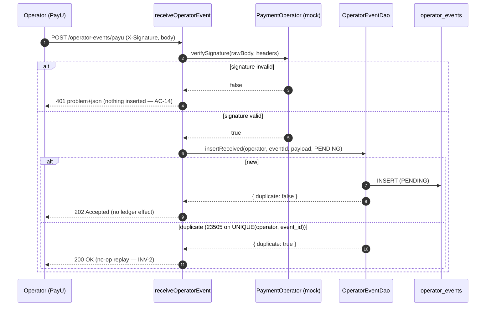

# Tech Spec: Exactly-Once Operator Ingestion (webhook → inbox → relay) — Deep Dive

- **Epic:** `edugo-payments-service-6siz`
- **Status:** Draft · **Date:** 2026-09-23 · **Author:** Krzysztof Jackowski
- **Depth:** Deep dive (sequence diagrams + detailed contracts)
- **Tickets:** `abzp` (operator abstraction + DAO), `fs5i` (webhook ingest), `9uk0` (inbox relay), `csfz` (invariant suite)
- **Relates to:** [ADR-0003](adr/0003-async-backbone.md) (async backbone), [ADR-0006](adr/0006-secrets-management.md) (secrets), [dual-operator routing](dual-operator-routing.md), [push-payment sequence](sequence-push-payment.md), [tech-spec: charge lifecycle & allocation](tech-spec-charge-lifecycle-payment-allocation.md), [PRD](prd.md) (FR-5, DD-2), [spec](../specs/payments/spec.md) (AC-13/14/15/18, INV-1/2/3)

---

## 1. Context & Goals

### Problem Statement

Money must be recorded **exactly once** from payment-operator confirmations, with a balance that is
provably equal to the sum of the ledger. This is the correctness core of the service: a payment
operator (PayU) delivers webhooks that are **at-least-once** — redelivered on timeout, replayed on
their retry schedule, and occasionally out of order. If each delivery credited an account we would
double-record; if a delivery were dropped we would lose a payment; if an event that cannot be tied to
an account were credited anyway we would credit the *wrong* account.

The schema and the architectural decision already exist. ADR-0003 chose a **transactional inbox +
CronJob relay** (Postgres + K8s, no message bus). The `operator_events` inbox table — with its
`UNIQUE (operator, operator_event_id)` dedup and its `status / attempts / next_attempt_at /
last_error` retry columns — is migrated (`db/migrations/1790150435617_payments-core.sql`). What is
missing is the **runtime path**: the `receiveOperatorEvent` handler is unimplemented and the relay
does not exist. This epic implements ingest → inbox → apply end-to-end and proves it with invariant
tests against real Postgres.

### Goals

- **G1 — Exactly-once apply (INV-2).** A redelivered or duplicate operator event yields **exactly one**
  `PAYMENT` ledger entry, regardless of delivery order or redelivery count.
- **G2 — Balance integrity (INV-1).** After every applied event, `account_balances.balance_minor ==
  SUM(ledger_entries.amount_minor)` for the account — maintained in the same transaction as the entry.
- **G3 — No unmatched credit (INV-3).** No `PAYMENT` entry is written without a matching, **resolvable**
  operator confirmation. An event that cannot be tied to an account is surfaced and dead-lettered,
  never credited to a guessed account.
- **G4 — Fast, side-effect-free ingest.** The webhook request verifies HMAC, inserts one inbox row, and
  ACKs — no business logic, no ledger write in the request path (ADR-0003 §2).
- **G5 — Operator-agnostic seams.** Both ingest and relay talk to a single `PaymentOperator` driven
  port; the domain never names an operator. A `MockPayUOperator` (PayU-shaped) proves the seam.
- **G6 — The tests are the deliverable.** An integration suite asserts INV-1/2/3 against real Postgres.

### Non-Goals

- **CronJob scheduling / K8s deployment.** The relay ships as an invocable, tested function
  (`runInboxRelayOnce`); wiring it to a `CronJob` (schedule, `concurrencyPolicy: Forbid`, advisory lock)
  is an ops concern (ADR-0003 §3, INFRA-3).
- **Real PayU integration + live HMAC secret.** M1 uses `MockPayUOperator` with a secret from config
  (ASM-1). The real PayU payload schema and Secret-Manager-sourced secret land later (ADR-0006).
- **Multi-operator routing / failover.** The router (FR-16) is *designed* in [dual-operator
  routing](dual-operator-routing.md) but not built here. This epic is single-operator (PayU) inbound.
- **Webhook rate limiting / IP allowlist.** Ingress/infra concern (ADR-0002 §5, NFR-6, PR-T3), not app code.
- **Out-of-order handling of *distinct* event types.** Genuine cross-type ordering (e.g. `refund` before
  `payment`) is deferred to the Tier-2 charge state machine (PR-T2). This epic tolerates redelivery and
  reordering of the *same* event via the dedup key; it does not model a multi-event lifecycle.
- **Backoff numbers / DLQ alert thresholds.** Open items on ADR-0003; placeholder values here, tuned later.

### Background

The **push** and **pull** payment paths both converge on this inbox (see [push-payment
sequence](sequence-push-payment.md)): the browser redirect on the push path is *UX only* — an account
moves **only** when the signed webhook is applied. So this one mechanism is the authoritative
record-money path for the entire service. `recordPayment` (the existing `POST /payments`) is a
separate, manual/back-office entry point (see Decision 6).

The epic builds directly on machinery from the [charge-lifecycle
spec](tech-spec-charge-lifecycle-payment-allocation.md): the `Money` value object, `PaymentDao`
(`insertPayment` / `appendLedgerEntry` / `incrementBalance`, all executor-bound with `23505` handling),
the `UnitOfWork` / `RepositoryBundle` transaction seam, and the oldest-first allocation logic in
`PaymentHub`. The relay reuses these verbatim inside one transaction.

### Stakeholders

- **Payments team (3 people)** — owns build + operation.
- **EduGo platform** — the downstream consumer; polls account status (does not receive pushes, ADR-0003 §4).
- **Payment operator (PayU)** — the webhook source; mocked in M1.
- **Back office** — drains the DLQ (`status = 'DEAD'`) and performs manual failover (AC-46).

---

## 2. Architecture Approach

### High-Level Design

Two runtime paths over one shared inbox table, split so that the money-moving work is decoupled from
the (untrusted, latency-sensitive) inbound request:

```
   PayU ──POST /operator-events/{operator}──▶  receiveOperatorEvent  (fast ACK path)
                                                 │  1. verify HMAC (PaymentOperator.verifySignature)
                                                 │  2. INSERT operator_events (PENDING)  ── dedup on UNIQUE(operator, event_id)
                                                 │  3. return 202 (or 200 on duplicate)   ── no ledger effect
                                                 ▼
                                          operator_events  (the inbox / DLQ)
                                                 ▲
   CronJob (~1 min) ── runInboxRelayOnce ────────┘  (apply path — one row, one transaction)
       loop until no due rows:
         BEGIN
           claim one due row  FOR UPDATE SKIP LOCKED   (oldest-first)
           normalise → resolve accountId + amount + correlationRef   (PaymentOperator.normalise)
           find-or-create payments row  (idempotency_key = "{operator}:{event_id}")
           append PAYMENT ledger entry  +  increment balance   (+ allocate across open charges)
           mark row PROCESSED, set operator_events.payment_id
         COMMIT   ── apply + mark share ONE txn ⇒ a crash re-processes safely (INV-2/3)
```

The design is a straight application of ADR-0003: **the inbox unique key gives at-most-once; the
single-transaction apply gives exactly-once effect.** Everything else is plumbing around those two facts.

### Design Decisions

#### Decision 1 — Split verify-and-queue from apply (ADR-0003 §2/§3)

The request handler does the minimum that must be synchronous and trustworthy: authenticate the sender
(HMAC), durably record the raw event, ACK. All interpretation and money movement happen later in the
relay. This keeps the request path fast and side-effect-free (a slow ledger write cannot make the
operator time out and redeliver), and it means a crash *after* the ACK but *before* apply loses
nothing — the row is durably `PENDING` and the relay picks it up.

**Rejected:** applying inline in the request. It couples operator-facing latency to our transaction, and
a mid-apply crash on a non-idempotent request path is exactly the bug the inbox exists to prevent.

#### Decision 2 — Dedup and exactly-once come from two different keys

Two independent guards, and it is worth being precise about which does what:

- **`operator_events` `UNIQUE (operator, operator_event_id)`** — the **ingest** dedup. A redelivered
  webhook cannot create a second inbox row (INV-2 at the door). `insertReceived` treats the `23505` as
  "already received → duplicate", not an error.
- **`payments` `UNIQUE (idempotency_key)`** — the **apply** dedup. Even if two relay workers somehow
  claimed logically-equivalent work, or a row were re-applied, the payment insert collides and the
  second is a no-op replay. This is the *same* guard `recordPayment` already relies on.

**Critical detail:** `operator_event_id` is unique only *per operator*; `payments.idempotency_key` is
**globally** unique. So the relay must key the payment on the **operator-qualified** value —
`idempotency_key = "${operator}:${operatorEventId}"` — never the bare `operatorEventId`. Using the bare
id would let two operators with a colliding event id block each other. (The bean says
`idempotency_key = operator_event_id`; this spec refines it to the qualified form for correctness.)

**What is `operator_event_id` for PayU?** PayU does **not** send a unique per-delivery event id — it
sends one notification per order **status change** (`PENDING` → `WAITING_FOR_CONFIRMATION` →
`COMPLETED`/`CANCELED`) and may redeliver each. The stable dedup unit is therefore
`(orderId, status)`, so `operator_event_id = "${orderId}:${status}"` and the money-recording apply keys
on the completion: `payments.idempotency_key = "payu:${orderId}:COMPLETED"`. A redelivered `COMPLETED`
notification collides on both the inbox dedup and the payment guard → exactly one `PAYMENT` (INV-2).
Only the terminal `COMPLETED` status records money; other statuses are inbox rows that resolve without
a ledger effect (they drive the charge state machine in Tier 2).

#### Decision 3 — One row per transaction; claim with `FOR UPDATE SKIP LOCKED`

`runInboxRelayOnce` loops: in each iteration it opens **one** `UnitOfWork` transaction, claims a single
due row (`SELECT … WHERE status IN ('PENDING','FAILED') AND (next_attempt_at IS NULL OR next_attempt_at
<= now()) ORDER BY received_at FOR UPDATE SKIP LOCKED LIMIT 1`), applies it, marks it, and commits;
then repeats until no due row remains.

- **Per-row transaction (not per-batch):** a poison row that rolls back must not roll back its innocent
  neighbours. One row per txn means one failure taints exactly one row.
- **`SKIP LOCKED`:** multiple relay pods (or an overlapping CronJob run) can drain concurrently without
  blocking each other or double-claiming — the row lock is held for the life of the apply transaction,
  so the mark-processed is inside the same lock. This is the standard Postgres queue pattern and is why
  no external queue is needed.
- **`operator_events_claim_idx (status, next_attempt_at)`** already exists to make the claim cheap.

**Failure bookkeeping runs in a *separate* transaction (subtle but load-bearing).** The mark-processed
happens in the apply transaction because a success must commit atomically with the ledger write. A
**failure must not** — an exception mid-apply (say `insertPayment` succeeded but `incrementBalance`
threw) aborts the whole Postgres transaction, so any `markFailed` written in that same transaction
would be rolled back with it and `attempts` would never advance — the row would retry forever and
never reach `DEAD`. So the relay distinguishes two failure sub-cases:

- **Clean unresolvable** (normalise resolves nothing, *no* ledger write was attempted): there is no
  partial write to roll back, so `markFailed` can commit in the same transaction.
- **Exception mid-apply** (any throw after a write began): the apply transaction rolls back, and the
  relay records the failure in a **fresh** transaction from the `catch` — exactly the pattern
  `PaymentHub.recordPayment` already uses to handle a post-rollback `DuplicateIdempotencyKeyError`.

Losing the claim lock on rollback is fine: `SKIP LOCKED` + the `payments` unique guard make a re-claim
idempotent; the point is only that the `attempts` / `next_attempt_at` update must **persist
independently** of the rolled-back apply. Sketch:

```ts
// clean cases commit inside; exception cases are caught and recorded in a new txn
let claimed: { id: string; attempts: number } | undefined;
try {
  await uow.withTransaction(async (repos) => {
    const row = await repos.operatorEvents.claimDueOne(now);
    if (!row) return;                       // nothing due — loop ends
    claimed = row;
    const norm = await paymentOperator.normalise(row.payload);   // may signal unresolvable
    if (!norm) {                            // clean unresolvable — no ledger write attempted
      await repos.operatorEvents.markFailed(row.id, 'unresolvable', backoff(row.attempts));
      return;                               // commits: the markFailed only
    }
    const paymentId = await applyCore(repos, norm);              // insert + ledger + balance + allocate
    await repos.operatorEvents.markProcessed(row.id, paymentId);
  });
} catch (err) {
  // The apply txn already rolled back — persist the failure in a SEPARATE txn.
  if (claimed) {
    const exhausted = claimed.attempts + 1 >= MAX_ATTEMPTS;
    await uow.withTransaction((repos) =>
      exhausted
        ? repos.operatorEvents.markDead(claimed!.id, String(err))
        : repos.operatorEvents.markFailed(claimed!.id, String(err), backoff(claimed!.attempts)));
  }
}
```

#### Decision 4 — `normalise` must **resolve the account**, or the event dead-letters (INV-3, PR-T1)

The single most important rule. `PaymentOperator.normalise(event)` returns
`{ accountId, amountMinor, currency, operatorEventId, correlationRef }` — and `accountId` is the result
of a **lookup**, not a field copied from an untrusted payload. If the event cannot be tied to a known
account (no matching pending charge / payment intent), `normalise` **surfaces it as unresolvable**; the
relay marks the row `FAILED` (→ retried, → `DEAD`) and writes **no** `PAYMENT`. An account is never
guessed. This is what makes INV-3 hold: a `PAYMENT` exists only for a confirmation we could resolve.

**Correlation anchor — resolved (PayU `extOrderId`, no migration).** PayU order creation accepts an
**`extOrderId`** — the *merchant's* own identifier, required to be unique within each point of sale —
and echoes it back in the `OrderCreateResponse` and in every notification for that order
([PayU auth-and-order](https://developers.payu.com/europe/docs/payment-flows/auth-and-order/)). So the
anchor already exists without a schema change: when the push path creates the PayU order it sets
`extOrderId = <our payment_intent id>`; the webhook carries it back; `normalise` resolves the
`payment_intent` (hence the account) by `extOrderId`, and stores PayU's own `orderId` into the existing
`payments.operator_reference`. If `extOrderId` resolves no intent, the event is unresolvable → dead-lettered
(INV-3). No new column is needed for M1; `MockPayUOperator` models the same `extOrderId` echo.

**The intent is settled on apply (status + intent-level idempotency).** In the same apply transaction,
a successful `COMPLETED` marks the resolved `payment_intent` `CONFIRMED` and links its `payment_id` — so
the push-path status is visible and a *distinct* later event resolving to an already-`CONFIRMED` intent
is dead-lettered rather than double-crediting (the per-event key guards redelivery of the *same* event;
this guards a second, different event for one intent).

**Amount is recorded as the operator confirms it, but a mismatch is flagged.** The `PAYMENT` entry uses
the **operator-confirmed** `amountMinor` (the operator actually moved that money — it is authoritative
for the ledger), not the expected intent/charge amount. When the confirmed amount differs from the
correlated intent/charge total (partial capture, wrong-amount confirmation, currency surprise), the
relay still records the payment but flags it. The M1 floor is a structured `warn` log + a metric;
persisting a `reconciliation_mismatches` row (the schema already has that table) is the clean landing
and can ship with the reconciliation epic that owns *resolving* the mismatch (refund, top-up, manual
review). Detecting the mismatch is in scope here; resolving it is not. Under PLN-only M1 a currency
mismatch cannot occur, but the check is written so it is enforced before multi-currency lands.

#### Decision 5 — `PaymentOperator` is a driven port; the mock is one adapter behind a registry

Following [dual-operator routing](dual-operator-routing.md): a single port
(`verifySignature(raw, headers)`, `normalise(event)`), several adapters, selected by the `{operator}`
path param via a small registry (`Record<string, PaymentOperator>`, e.g. `{ payu: MockPayUOperator }`).
An unknown operator is a `400` (§3), never a crash. The domain and the relay never branch on operator
name — adding Tpay/Stripe later is a new adapter + a registry entry, no change to ingest or relay.

The HMAC secret is read from the **Zod env/config loader** (`OPERATOR_WEBHOOK_SECRET`, or per-operator
later), **never hardcoded** (PR-T3); Secret Manager sourcing follows per ADR-0006.

**Money crosses the JSON boundary as a string, never a JS number.** The amount lives in
`operator_events.payload` (jsonb); a `JSON.parse` turns a numeric field into a float64 `number`, which
silently loses integer precision above 2^53 — exactly where a large minor-unit amount is most damaging.
The adapter's `normalise` **must** read the amount from an integer-safe field (a string, or minor-unit
integer already carried as a string) and convert with `BigInt(...)`, never through a `number`
intermediate. This is the "money is `bigint`" invariant enforced at the operator boundary; the
`MockPayUOperator` payload models the amount as a string so tests exercise the safe path. A payload that
carries the amount as a bare JSON number is treated as malformed (rejected / `FAILED`), not silently
coerced.

#### Decision 6 — The webhook is authoritative; `recordPayment` is retained as the manual path (PR-T1)

Explicit answer to the bean's question: **operator confirmations flow only through the relay**, never
through `POST /payments`. `recordPayment` is **retained as a manual / back-office path** — e.g. a
finance operator recording a bank-transfer receipt that never produces an operator webhook. Both write
through `PaymentDao.insertPayment` and share the `payments.idempotency_key` UNIQUE guard, so neither can
double-record. The two key namespaces are kept disjoint by an **enforced convention**, not by structural
impossibility: relay keys are `"${operator}:${eventId}"` and manual keys carry a reserved `"manual:"`
prefix (validated at the boundary). A collision would be caught by the UNIQUE guard as a replay rather
than a double-record, so the convention is a clarity/operational safeguard, not a correctness
dependency. This keeps a single ledger-writing primitive with two front doors.

#### Decision 7 — Reuse the record-and-allocate core, don't duplicate it

The relay's apply is `recordPayment` minus the HTTP shell plus the inbox bookkeeping. Rather than a
second copy of "insert payment → append PAYMENT → increment balance → allocate oldest-first", extract
that core into a private `PaymentHub` helper that takes an already-open `RepositoryBundle`, and have
**both** `recordPayment` and the new `applyOperatorEvent` call it. The relay adds only:
resolve-or-dead-letter (Decision 4) and mark-processed — inside the **same** transaction. This is the
one change to `PaymentHub`; the `RepositoryBundle` gains an `operatorEvents` repo so the mark is atomic
with the apply.

#### Decision 8 — Unresolvable / failed = retry-then-DLQ, not immediate hard-fail

A `FAILED` apply (transient DB error, or an unresolvable event whose charge/intent may simply be
arriving late) increments `attempts`, sets `next_attempt_at` via bounded exponential backoff, records
`last_error`, and — for the exception path — **rolls back the apply atomically (no partial write) while
persisting the failure bookkeeping in a separate transaction** (Decision 3). When `attempts` exhausts
the cap the row goes `DEAD` (the DLQ). Retrying an unresolvable event is deliberate — it gives a
slightly-late intent a chance to land — and bounded so a genuinely orphaned event still terminates in
the DLQ for back-office follow-up (AC-45). Backoff schedule and cap are ADR-0003 open items;
placeholders in §7.

### Module/Package Placement

Hexagonal, mirroring the existing `ledger/` and `charges/` sub-domains. The inbox is part of the
**ledger** kernel (it records money); the operator port is a new seam.

```
src/payments/ledger/
  domain/
    port/
      PaymentOperator.ts          NEW  driven port: verifySignature + normalise
      UnitOfWork.ts               EDIT RepositoryBundle gains `operatorEvents`
    model/
      OperatorEvent.ts            NEW  domain type (status enum, normalised shape)
  adapter/
    storage/
      OperatorEventDao.ts         NEW  executor-bound DAO over operator_events (mirror PaymentDao)
    operator/
      MockPayUOperator.ts         NEW  PayU-shaped adapter (HMAC + normalise)
    http/incoming/
      OperatorEventApiImpl.ts     NEW  receiveOperatorEvent handler (glue by operationId)
      OperatorEventMapper.ts      NEW  DTO ↔ domain
  application/ (in src/payments/application/)
    InboxRelay.ts                 NEW  runInboxRelayOnce — claim/apply/mark loop
    PaymentHub.ts                 EDIT extract record-and-allocate core; add applyOperatorEvent

src/platform/
  container.ts                    EDIT register operatorEvents repo, operator registry, inboxRelay
  config/env.ts                   EDIT add OPERATOR_WEBHOOK_SECRET (Zod)
  http/security.ts                (already allowlists /operator-events/ — no change)

test/payments/
  operator-event-dao.int.test.ts  NEW  (abzp)
  operator-ingest.int.test.ts     NEW  (fs5i)
  inbox-relay.int.test.ts         NEW  (9uk0)
  exactly-once-invariants.int.test.ts  NEW  (csfz) — INV-1/2/3 end-to-end
```

### Cross-Component Impact

- **`RepositoryBundle`** gains `operatorEvents: OperatorEventRepository`. `PaymentRepositoryDB.withTransaction`
  constructs an `OperatorEventDao(trx)` alongside `PaymentDao`/`ChargeDao` on the same transaction.
- **`Cradle`** (`container.ts`) gains a `paymentOperators` registry and an `inboxRelay`. The
  full-contract boot test (`server-boot.int.test.ts`) must still pass (PR-T5).
- **`env.ts`** gains a required (in non-dev) `OPERATOR_WEBHOOK_SECRET`.
- **Error handler** (`server.ts` `setErrorHandler`): HMAC failure is surfaced as a `401` from the handler
  directly (the route is public/non-bearer), not via a `DomainError`. No new mapping needed there.

---

## 3. API Design

### Endpoint: `POST /operator-events/{operator}` — `operationId: receiveOperatorEvent`

Public route (HMAC-authenticated, `security: []` in the contract; already in the `security.ts`
allowlist). The contract is the source of truth (`openapi/openapi.yaml`).

- **Path param:** `operator` (e.g. `payu`) — selects the adapter from the registry.
- **Header:** `X-Signature` — HMAC of the **raw** request body (ASM-1). Verified before parsing/trusting
  the body.
- **Body:** `OperatorEvent` — `{ operatorEventId, type, occurredAt?, payload }`.
- **Responses:**
  - `202 Accepted` — verified, new inbox row inserted `PENDING`, enqueued. **No ledger effect.**
  - `200 OK` — duplicate `(operator, operatorEventId)` — no-op replay (INV-2).
  - `400 Bad Request` — malformed body (ajv).
  - `401` — HMAC verification failed → **nothing inserted** (AC-14), `application/problem+json`.
  - `400 Bad Request` — unknown `operator` (no adapter registered). The `receiveOperatorEvent` contract
    declares `200/202/400/401` only, so unknown-operator maps to the declared `400`; it does **not**
    invent a `404`. (If a distinct `404` is later wanted, add it to `openapi.yaml` first, per API-first.)

> **Contract vs. ticket discrepancy (resolve in favour of the contract).** Bean `fs5i` says "return
> `200` immediately"; the OpenAPI contract distinguishes **`202` (accepted/enqueued)** from **`200`
> (duplicate no-op)**. Per CLAUDE.md the contract is the source of truth — implement `202`/`200`. If a
> single `200` is preferred, edit `openapi.yaml` first, then regenerate.

The handler is wired via `OperatorEventApiImpl` bound by `operationId` (fastify-openapi-glue), same
shape as `PaymentApiImpl`.

### Internal contract: `PaymentOperator` (driven port)

```ts
export interface NormalisedEvent {
  accountId: string;        // RESOLVED via lookup — never copied from the payload (INV-3)
  amountMinor: bigint;
  currency: string;
  operatorEventId: string;
  correlationRef: string | null; // e.g. the resolved payment_intent / charge id
}

export interface PaymentOperator {
  /** Constant-time HMAC check of the raw body against the configured secret. */
  verifySignature(rawBody: Buffer, headers: Record<string, string | undefined>): boolean;
  /** Resolve + normalise. Throws UnresolvableOperatorEventError when no account matches. */
  normalise(event: OperatorEvent): Promise<NormalisedEvent>;
}
```

### Internal contract: `OperatorEventRepository` (driven port) / `OperatorEventDao`

Executor-bound, mirroring `PaymentDao` (`Executor = Kysely<DB> | Transaction<DB>`, `23505` handling):

- `insertReceived(input): Promise<{ id: string; duplicate: boolean }>` — dedup-aware INSERT; a `23505`
  on the dedup constraint returns `{ duplicate: true }` (not a throw).
- `claimDueOne(now): Promise<OperatorEventRow | null>` — `FOR UPDATE SKIP LOCKED`, oldest-first, `LIMIT 1`.
- `markProcessed(id, paymentId)` / `markFailed(id, err, nextAttemptAt)` / `markDead(id, err)`.

### Internal contract: `InboxRelay`

- `runInboxRelayOnce(): Promise<{ processed: number; failed: number; dead: number }>` — drains all due
  rows, one transaction each; returns counts for observability/tests. CronJob wiring out of scope.

---

## 4. Sequence Diagrams

### Ingest — verify, dedup, fast ACK (`fs5i`)



### Apply — one row per transaction (success commits atomically; failure books in a second txn) (`9uk0`)

```mermaid
sequenceDiagram
    autonumber
    participant CRON as CronJob (~1 min)
    participant RELAY as runInboxRelayOnce
    participant UOW as UnitOfWork (one trx)
    participant EV as OperatorEventDao
    participant PORT as PaymentOperator
    participant PAY as PaymentDao
    participant CH as ChargeDao

    CRON->>RELAY: invoke
    loop until no due row
        RELAY->>UOW: withTransaction (apply txn)
        rect rgb(230,240,255)
        Note over UOW,CH: apply txn — a SUCCESS commits apply + mark atomically (INV-2/3)
        UOW->>EV: claimDueOne()  (FOR UPDATE SKIP LOCKED, oldest-first)
        EV-->>UOW: row | null
        UOW->>PORT: normalise(row.payload) → resolve accountId
        alt resolved
            UOW->>PAY: insertPayment(idem = "operator:eventId")
            alt fresh
                UOW->>PAY: appendLedgerEntry(PAYMENT +) ; incrementBalance
                UOW->>CH: allocate oldest-first (ledger-neutral)
                UOW->>EV: markProcessed(id, paymentId)   ── commit
            else 23505 (already applied)
                UOW->>EV: markProcessed(id, existing paymentId)  (no 2nd entry) ── commit
            end
        else clean unresolvable (no ledger write attempted)
            UOW->>EV: markFailed(id, "unresolvable", backoff) ── commit (nothing to roll back)
        end
        end
        opt exception mid-apply (any throw after a write began)
            Note over RELAY,EV: apply txn ROLLED BACK — no PAYMENT (INV-3)
            RELAY->>UOW: withTransaction (fresh txn)
            UOW->>EV: markFailed(id, err, backoff)  →  markDead when attempts exhausted
        end
    end
```

---

## 5. Data Model

No new migration — `operator_events` and `payments` already carry every column. This section documents
how the epic **uses** the existing schema.

### `operator_events` (the inbox / DLQ) — written by ingest, driven by the relay

| Column | Written by | Notes |
|---|---|---|
| `operator`, `operator_event_id` | ingest | dedup pair; `UNIQUE (operator, operator_event_id)` = INV-2 at the door |
| `event_type` | ingest | operator's event type (mapped onto our state machine later) |
| `signature_verified` | ingest | `true` — rows only exist for verified events (invalid → 401, no row) |
| `payload` (jsonb) | ingest | raw normalised-later payload |
| `status` | both | `PENDING → PROCESSED` \| `FAILED → DEAD`; enum also has `DUPLICATE`/`REJECTED` (unused in M1 — see §10) |
| `attempts`, `next_attempt_at`, `last_error` | relay | retry/backoff/DLQ bookkeeping (Decision 8) |
| `payment_id` | relay | set on `PROCESSED` — the resulting payment (audit trail confirmation ↔ ledger) |
| `received_at`, `processed_at` | both | timestamps |

Claim uses `operator_events_claim_idx (status, next_attempt_at)`; the `payment_id` back-reference uses
`operator_events_payment_id_idx`.

### `payments` — written by the relay apply

- `idempotency_key = "${operator}:${operatorEventId}"` (Decision 2) — the apply-side exactly-once guard.
- `operator`, `operator_reference` set from the normalised event; `amount_minor` as `bigint` string
  (round-trips via `.toString()` / `BigInt(...)`, per the money rule).
- One `PAYMENT` `ledger_entries` row (positive/credit) + one `account_balances` increment, same txn.

### Inbox state machine (M1 subset)

```
                 insertReceived
        (verified, new) │
                        ▼
                    PENDING ───────── claim + apply OK ─────────▶ PROCESSED  (payment_id set)
                        │  ▲
        apply fails /   │  │ retry due (next_attempt_at ≤ now)
        unresolvable    ▼  │
                     FAILED ──── attempts exhausted ───▶ DEAD  (DLQ; back-office — AC-45)

   duplicate at ingest → no new row (existing row unchanged); handler returns 200
```

`DUPLICATE` / `REJECTED` enum values are **not** materialised as rows in M1 (a duplicate is a no-op at
the unique constraint; an invalid signature inserts nothing). They are reserved for a later
audit-logging variant (§10, open question).

---

## 6. Integration Points

- **Inbound — operator webhook.** `POST /operator-events/{operator}`, HMAC over the raw body. Public
  route (already allowlisted in `security.ts`). Mocked by `MockPayUOperator` in M1.
- **Config / secrets.** `OPERATOR_WEBHOOK_SECRET` via the Zod `env.ts` loader; Secret Manager later
  (ADR-0006). Never in source (PR-T3).
- **Downstream — EduGo platform.** Unchanged and pull-based (ADR-0003 §4): EduGo polls account status;
  this epic writes no outbound push. The relay's effect (updated balance / settled charge) simply
  becomes visible to the next poll, ~1–2 min after the webhook (the revised NFR-2/3 latency).
- **Relay execution.** M1: invoked directly in tests via `runInboxRelayOnce`. Prod: a K8s CronJob
  (`concurrencyPolicy: Forbid`, ~1 min) — out of scope, but the function is the unit that CronJob calls.
- **DI.** `container.ts` registers the operator registry, the `operatorEvents` repo (via the
  `RepositoryBundle`), and `inboxRelay`. Boot test must stay green (PR-T5).

---

## 7. Non-Functional Requirements

### Correctness invariants (the real NFR here)

The deliverable of ticket `csfz` — asserted end-to-end against real Postgres:

- **INV-1** — `account_balances.balance_minor == SUM(ledger_entries.amount_minor)` per account, after
  every applied event. Held because the `PAYMENT` entry and the balance increment share one transaction.
- **INV-2** — every operator event applied **at most once**. Two guards: ingest dedup
  `UNIQUE(operator, event_id)` and apply dedup `payments.idempotency_key`. A confirmation delivered
  twice ⇒ exactly one `PAYMENT`.
- **INV-3** — no `PAYMENT` without a matching **resolvable** confirmation. An unresolvable event writes
  nothing and dead-letters; a charge with no confirmation is never marked paid (AC-12/13).

### Performance / latency

- Ingest is O(1): one HMAC verify + one indexed INSERT; target well under the operator's webhook
  timeout so we never induce redelivery by being slow.
- Apply latency is bounded by the CronJob cadence (~1–2 min, the revised NFR-2/3) — accepted; balance
  **reads** stay O(1) (NFR-2 read target unchanged).
- Single-digit TPS (A2) — no throughput concern; `SKIP LOCKED` allows horizontal relay scaling if ever
  needed.

### Reliability / retries

- Backoff: bounded exponential, **≤ 5 attempts** then `DEAD` (AC-45) — **placeholder**, ADR-0003 open
  item. `next_attempt_at` gates the claim.
- Crash safety: apply + mark-processed in one txn ⇒ a process crash mid-apply rolls back cleanly, the
  row stays `PENDING`/claimable, and re-processing hits the `payments` unique guard as a no-op (INV-2).
  An *application-level* exception is different: it advances `attempts` toward `DEAD` via the separate
  failure txn (Decision 3), so a genuine poison row terminates instead of hot-looping.
- DLQ depth = `count(status = 'DEAD')` feeds NFR-9 alerting (threshold TBD, ADR-0003 open item).

### Security

- HMAC verified on the **raw** body before trusting any field, with a **constant-time** comparison.
  Invalid ⇒ `401`, no row, no ledger effect (AC-14).
- Secret from config/Secret Manager, never source (PR-T3, ADR-0006).
- The account is **resolved**, never taken from the payload — a forged/malformed payload cannot direct a
  credit to an attacker-chosen account (INV-3).
- The amount crosses the jsonb boundary as a **string → `BigInt`**, never a JS `number` (Decision 5) —
  no silent precision loss on large minor-unit amounts.
- Rate limiting / IP allowlist are ingress concerns (out of scope, ADR-0002 §5).

---

## 8. Observability

- **Metrics:** inbox depth by status (`PENDING`/`FAILED`/`DEAD`), relay run counts
  (`processed`/`failed`/`dead` returned by `runInboxRelayOnce`), apply latency, HMAC-failure count.
- **DLQ alert:** on `count(status='DEAD') > threshold` (NFR-9; threshold is an ADR-0003 open item).
- **Audit trail:** `operator_events.payment_id` links each confirmation to its resulting payment;
  `last_error` retains the terminal failure reason for back-office triage.
- **Tracing:** relay spans per row (operator, event id, outcome) under the existing opt-in OTEL setup
  (starts only when `OTEL_EXPORTER_OTLP_ENDPOINT` is set).

---

## 9. Rollout Strategy

Phased by ticket dependency (`abzp` → {`fs5i`, `9uk0`} → `csfz`).

### Phase 1 — Foundation: operator abstraction + DAO (`abzp`), first

`PaymentOperator` port, `MockPayUOperator`, `OperatorEventDao`, `OperatorEvent` domain type; extend
`RepositoryBundle` with `operatorEvents`; register in `container.ts`; add `OPERATOR_WEBHOOK_SECRET` to
`env.ts`. **Gate:** boot test green (PR-T5); DAO tests (verify, dedup, claim ordering, account
resolution); `pnpm typecheck` green. May split into DAO vs. port as two tasks if it helps parallelism
(PR-T4). Correlation is settled (resolve by PayU `extOrderId` = `payment_intent` id, no migration —
Decision 4); confirm the PayU notification **signature format** when the real adapter replaces the mock
(§10 #1).

### Phase 2 — Ingest (`fs5i`) and Relay (`9uk0`), both blocked by Phase 1

- **Ingest:** `receiveOperatorEvent` — verify → insert → `202`/`200`; invalid → `401` no row. Wire by
  `operationId`. Tests: valid→202+row, invalid→rejected no row, duplicate→one row both ACK.
- **Relay:** extract the record-and-allocate core in `PaymentHub` (Decision 7); add `applyOperatorEvent`
  + `InboxRelay.runInboxRelayOnce`. Tests: apply-once, replay no-op, unresolvable→DEAD, failure→rollback.

These two can proceed in parallel once Phase 1 lands (ingest depends only on the DAO+port; relay depends
on the DAO+port and the `PaymentHub` core).

### Phase 3 — Invariant suite (`csfz`), blocked by `fs5i` + `9uk0`

End-to-end ingest → relay integration suite asserting INV-1/2/3 and the redelivery/dedup case, in the
`record-payment.int.test.ts` style (each test seeds its own account/keys). This is the epic's
Definition-of-Done gate.

### Rollback

Pure additive: new files, a widened `RepositoryBundle`, new DI registrations, one new env var, a
`PaymentHub` refactor. No migration, no change to existing endpoints. Reverting the commits removes the
ingest handler and relay; the existing `recordPayment` path and all prior behaviour are untouched. The
`operator_events` table already exists and stays empty/inert if the epic is reverted.

---

## 10. Open Questions & Risks

### Open Questions

1. **PayU notification signature format (confirm during `abzp`).** PayU authenticates notifications with
   an `OpenPayU-Signature` header over the raw body plus the POS "second key" (the MD5/SHA key from the
   config). The exact header grammar and hash algorithm must be confirmed against PayU's current
   notification reference when wiring the real adapter (M1 uses `MockPayUOperator`, so this does not
   block the epic — only the eventual real PayU adapter). `verifySignature` is written to that shape.
2. **`202` vs `200` on ingest.** Contract says `202` accepted / `200` duplicate; bean `fs5i` says `200`.
   This spec follows the contract. Confirm, or amend `openapi.yaml` first.
3. **Backoff schedule + max attempts + DLQ alert threshold.** All three are ADR-0003 open items;
   placeholders used (≤5 attempts, exponential). Tune before prod CronJob wiring.
4. **`DUPLICATE`/`REJECTED` inbox rows.** M1 does not materialise them (duplicate = no-op, invalid =
   no row). Do we want an *audit* row for rejected/duplicate deliveries (security forensics), or is the
   metric counter enough? Deferred.
5. **Amount-mismatch row vs. log (M1).** Decision 4 records the operator-confirmed amount and *flags* a
   mismatch; M1 floor is a `warn` log + metric. Confirm whether the `reconciliation_mismatches` row
   ships now or with the reconciliation epic (this spec defers the row).

*Resolved (were open, now decided in the body):* **correlation anchor** — PayU echoes our
`extOrderId` (= the `payment_intent` id) in the notification, so `normalise` resolves by it with **no
migration** (Decision 4); **dedup / event-id for PayU** — `(orderId, status)`, money keyed on
`"payu:${orderId}:COMPLETED"` (Decision 2); idempotency-key format — operator-qualified with a reserved
`"manual:"` prefix for the back-office path (Decision 2/6); amount precision across the jsonb boundary —
string → `BigInt` (Decision 5); unknown-operator status — the contract's `400`, not a `404` (§3).

### Risks

| Risk | Mitigation |
|---|---|
| Duplicate / crash mid-apply double-records | apply + mark in **one** txn; two unique guards (Decision 2); INV-2 test |
| Event cannot be mapped to an account → wrong-account credit | `normalise` resolves or the row goes `DEAD`; never guessed (INV-3, Decision 4) |
| `operator_event_id` collision across operators | operator-qualified `payments.idempotency_key` (Decision 2) |
| Poison row stalls the queue / never dead-letters | per-row transaction; failure bookkeeping committed in a **separate** txn so `attempts` advances despite the apply rollback → backoff → `DEAD` DLQ (Decision 3/8) |
| Two relay pods race the same row | `FOR UPDATE SKIP LOCKED`; lock held through the apply (Decision 3) |
| Late-arriving intent makes a valid event look unresolvable | retry-then-DLQ tolerates mild lateness (Decision 8); genuine cross-type ordering deferred to Tier-2 (PR-T2) |
| HMAC secret leakage | config/Secret Manager only, constant-time compare (PR-T3, ADR-0006) |

---

## Glossary

- **Inbox / transactional inbox** — the `operator_events` table; durable landing zone for verified
  webhooks, drained by the relay (ADR-0003).
- **Relay** — `runInboxRelayOnce`; claims due inbox rows and applies each in its own transaction (a
  success commits atomically; a mid-apply failure books its retry state in a separate transaction).
- **DLQ** — dead-letter queue; inbox rows in `status = 'DEAD'` after exhausting retries (AC-45).
- **Normalise** — the operator adapter step that verifies + **resolves the account** and maps an
  operator payload onto `NormalisedEvent`.
- **Exactly-once effect** — at-most-once (unique keys) + at-least-once (durable inbox + retry) = the
  effect is applied exactly once (ADR-0003).
- **INV-1/2/3** — balance == Σ ledger; apply at most once; no unmatched `PAYMENT`.

## References

- [ADR-0003 — Async backbone](adr/0003-async-backbone.md) · [ADR-0006 — Secrets](adr/0006-secrets-management.md)
- [Dual-operator routing](dual-operator-routing.md) · [Push-payment sequence](sequence-push-payment.md)
- [Tech spec — Charge lifecycle & payment allocation](tech-spec-charge-lifecycle-payment-allocation.md)
- [Spec](../specs/payments/spec.md) (AC-13/14/15/18, INV-1/2/3) · [Operator-degraded feature](../specs/payments/features/operator-degraded.feature)
- Epic `6siz`; tickets `abzp`, `fs5i`, `9uk0`, `csfz` (`.beans/`)
- [PayU — Authorize and Order](https://developers.payu.com/europe/docs/payment-flows/auth-and-order/) (`extOrderId`, `orderId`, order status) · [PayU get-started](https://developers.payu.com/europe/pl/docs/get-started/)
